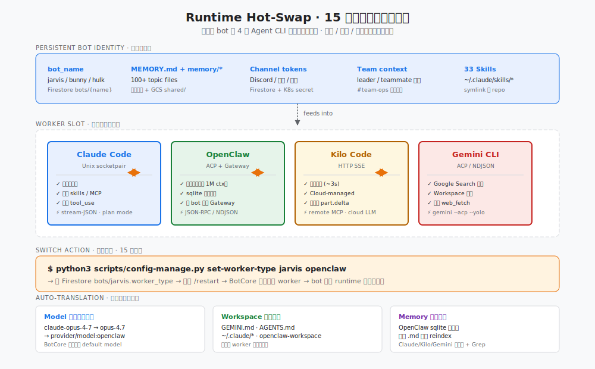

# CloseCrab 🦀

<p align="right">
  <a href="README.md"></a>
  <a href="README.en.md"></a>
  <a href="https://opensource.org/licenses/Apache-2.0"></a>
</p>

<p align="center">
  
</p>

> **Run Claude Code, OpenClaw, Kilo Code, and Gemini CLI as 24/7 chat bots on Lark/Feishu, Discord, and DingTalk — with shared memory, bot-to-bot collaboration, hot-swappable runtimes, and browser-based voice calling.**

CloseCrab wraps the world's best AI agent CLIs into multi-platform chat bots. It does not re-implement agent capabilities — it directly drives the CLI processes, so **every upstream skill, plugin, and MCP server works out of the box, with zero adaptation required**.

> 🇨🇳 **中文读者**：请见 [README.md](README.md) 阅读完整中文文档。

---

## Capability Matrix

**4 agent runtimes · 3 chat platforms · 33 built-in skills · 1 unified identity and memory.**

| Dimension | Capability |
|---|---|
| 💬 **Platforms (3, Lark-first)** | Lark / Feishu (primary) · Discord · DingTalk |
| 🔄 **Runtimes (4, hot-swap)** | Claude Code · OpenClaw · Kilo Code · Gemini CLI — switch any bot in 15 seconds |
| 🎙️ **Voice I/O** | Lark voice messages STT + TTS reply · `/voice` for browser-based LiveKit calls |
| 🧠 **Shared memory** | MEMORY.md + 100+ topic files + GCS sync + OpenClaw sqlite vector index |
| 🤝 **Bot teams** | Cross-machine collaboration via `#team-ops` channel + real-time Firestore inbox |
| 🔧 **33 built-in skills** | Wiki · Imagen/Veo/TTS generation · Lark suite (mail/doc/sheet/bitable) · Chrome automation · skill-creator self-hosting |
| 📄 **CC Pages** | Bot-generated HTML reports, one-command publish to GCS + custom domain |
| 🛠️ **Cross-worker utility scripts** | `cron-tool` reminders · `subagent-parallel` real parallelism · `session-status` self-check |
| 🔌 **Full upstream ecosystem** | Claude Code skills · MCP servers · Gemini extensions · OpenClaw plugins |

---

## Architecture

<p align="center">
  
</p>

### Module Map

| Layer | Path | Implementation |
|---|---|---|
| **Entry point** | `closecrab/main.py` | CLI parsing, config loading, system prompt building, signal handling |
| **Core** | `closecrab/core/bot.py` | BotCore: message routing, per-user worker, Firestore logs, emergency stop |
| **Channels (3+1)** | `closecrab/channels/` | `feishu.py` · `feishu_streaming_card.py` · `discord.py` · `dingtalk.py` |
| **Workers (4 active)** | `closecrab/workers/` | `claude_code.py` · `openclaw_acp.py` · `kilo.py` · `gemini_acp.py` |
| **STT** | `closecrab/utils/stt.py` | Gemini → Chirp2 → Whisper fallback chain |
| **Inbox** | `closecrab/utils/firestore_inbox.py` | Bot-to-bot real-time messaging (Firestore `on_snapshot`) |
| **Voice** | `scripts/install-livekit.sh` | LiveKit server + frontend + Caddy + systemd one-shot installer |

---

## The 4 Runtimes · Runtime Hot-Swap

Each runtime is a different AI agent CLI. CloseCrab lets the same bot switch between them at runtime — **identity, memory, and team context are all preserved across switches**.

<p align="center">
  
</p>

| Runtime | Transport | Strength | Switch command |
|---|---|---|---|
| **Claude Code** | Unix socketpair · stream-JSON | Richest tools, native skills, parallel tool_use, plan mode | `set-worker-type bot claude` |
| **OpenClaw** | ACP / JSON-RPC + external Gateway | Widest model support, 1M-token capable, sqlite semantic memory, shared Gateway | `set-worker-type bot openclaw` |
| **Kilo Code** | HTTP SSE | Fastest cold start (~3s), real-streaming part.delta, Cloud-managed | `set-worker-type bot kilo` |
| **Gemini CLI** | ACP / NDJSON | Google Search grounding, Workspace extensions, built-in web_fetch | `set-worker-type bot gemini` |

**What's auto-handled on switch**: model namespace translation (`claude-opus-4-7` → `provider/model:openclaw`) · workspace file self-healing (GEMINI.md / AGENTS.md rewritten if missing) · memory index rebuild (OpenClaw sqlite scans on startup).

> Further reading: [Hybrid Agent Runtimes — how 4 agent CLIs absorb each other's capabilities](https://blog.higcp.com/2026/05/17/hybrid-agent-runtimes/)

---

## Persistent Shared Memory

<p align="center">
  
</p>

Every bot has a four-layer persistent memory that survives restarts, runtime switches, and machine migrations:

| Layer | Content | Load timing |
|---|---|---|
| **① MEMORY.md** | Bot identity + user preferences + topic index (~200-line hard limit) | Auto-injected into every conversation's system prompt |
| **② memory/*.md** | 100+ topic files: `feedback_*` lessons learned · `project_*` long-running notes · `user_*` preferences · `reference_*` references | Read on demand |
| **③ shared/*.md** | Team infrastructure docs, gcsfuse-mounted from `gs://chris-pgp-host-asia/memory/shared/` | Real-time shared across bots |
| **④ OpenClaw sqlite vector index** | Scans all `.md` on startup, exposes `memory_search` MCP tool | OpenClaw runtime bonus (other workers use Read+Grep) |

**Auto-write**: agents proactively persist user / feedback / project / reference-level information they discover mid-conversation — inspired by the [Karpathy LLM Wiki](https://gist.github.com/karpathy/442a6bf555914893e9891c11519de94f) philosophy of **knowledge compilation rather than retrieval**.

---

## Bot Team Collaboration

Multi-bot cross-machine collaboration uses two channels:

- **Coordination channel**: Leaders dispatch tasks in `#team-ops` Lark/Discord channels via `@mention`; teammates report back to `@Leader` when done
- **Async channel**: `scripts/inbox-send.py` writes to the Firestore `messages` collection; the target bot is **pushed in real-time** via `on_snapshot` (not polling)

<p align="center">
  
</p>

```bash
# Leader dispatches a task to a teammate (async, non-blocking)
python3 scripts/inbox-send.py bunny "Run Llama 4 benchmark on B200, write the report to CC Pages and send me the link"
```

**Team roles** are stored in Firestore as `bots/{name}.team`. `build_system_prompt()` dynamically injects coordination rules based on role, so a Leader sees a different system prompt than a Teammate.

---

## Voice I/O

Two voice entry points:

| Entry | Trigger | Pipeline |
|---|---|---|
| **Voice message** | User sends a voice message in Lark / Discord | Channel-layer STT (Gemini→Chirp2→Whisper) → BotCore → bot reply + TTS voice summary |
| **Browser call** | User sends `/voice` in Lark | Bot returns a LiveKit URL → user opens in browser → bidirectional real-time STT/TTS |

LiveKit calling stack (one-shot installer: `scripts/install-livekit.sh`):
- **livekit-server** + **livekit-frontend** (forked from `agent-starter-react`) + **Caddy** auto LE cert + **systemd unit**
- Multiple bots share one LiveKit infra per machine, routed via URL `?bot=` param + per-bot HMAC key for signature verification
- STT/TTS go through Vertex AI's Gemini, requires `roles/aiplatform.user`

See [docs/voice-deploy-quickstart.md](docs/voice-deploy-quickstart.md) for full deployment.

---

## 33 Built-in Skills

Each skill is `skills/{name}/SKILL.md` plus optional `scripts/` and `references/`. `deploy.sh` auto-symlinks them to `~/.claude/skills/{name}`. Use the `skill-creator` skill to bootstrap a new one.

| Category | Skills |
|---|---|
| **Office (Lark)** | `feishu-mail` · `feishu-doc` · `feishu-sheet` · `feishu-bitable` (Bitable / Base) |
| **Knowledge** | `wiki` (180+ pages Quartz wiki, 9 MCP tools) · `code-wiki-recon` (rapid unfamiliar-repo recon) · `paper-explainer` · `fireworks-tech-graph` |
| **Multimedia** | `imagen-generator` (Imagen 4) · `veo-generator` (Veo 3.1) · `tts-generator` (Gemini TTS, 15 voices + emotion tags) · `frontend-slides` (HTML slides) · `math-video-tutor` |
| **Browser / WeChat** | `chrome-browser` (Chrome MCP fallback) · `wechat-reader` |
| **Infrastructure** | `tmux-installer` · `tmux-orchestrator` · `zsh-installer` · `lustre-mounter` · `lssd-mounter` · `bwrap-bypass` (bypass Claude Code sandbox) · `vscode-reference` |
| **AI training / inference** | `maxdiffusion-trainer` |
| **Meta** | `skill-creator` (self-hosting) · `agent-teams` (team coordination) · `bot-config` · `chat-style` · `page-style` · `notify` · `issue-handler` · `session-handoff` · `gemini-ui-reviewer` (UI review) · `go-eat` (cafeteria menu) |

---

## Cross-Worker Utility Scripts

These work across all worker types — no dependency on any specific runtime:

```bash
# Real parallel LLM sub-agents (each with independent reasoning + bash + read)
python3 scripts/subagent-parallel.py --inline '{"tasks":[{"label":"A","prompt":"..."}]}'

# Reminders / cron (30s precision, daemon runs automatically)
python3 scripts/cron-tool.py add --target <bot> --in 10m --message "..."
python3 scripts/cron-tool.py add --target <bot> --cron "0 9 * * MON-FRI" --message "..."
python3 scripts/cron-tool.py list|remove <id>

# Self-check: model / cost / token / recent turns
python3 scripts/session-status.py <bot> [--days N]

# Image generation (Gemini 3 Pro Image)
~/CloseCrab/skills/imagen-generator/scripts/imagen-generate.sh "prompt" --aspect 16:9

# Voice generation (Gemini TTS, 15 voices + emotion tags)
~/CloseCrab/skills/tts-generator/scripts/tts-generate.py "[casually] hello"
```

---

## Quick Start

```bash
# 1. Clone
git clone https://github.com/yangwhale/CloseCrab.git && cd CloseCrab

# 2. Configure Firestore (only project + database; everything else lives in Firestore)
cp .env.example .env && vim .env

# 3. One-shot deploy (interactive prompts for API keys; installs Claude Code + Gemini CLI + Skills + Python deps)
./deploy.sh

# 4. Create a bot (Lark recommended as default channel)
python3 scripts/config-manage.py create mybot --channel feishu \
    --app-id "cli_xxxxxxx" --app-secret "xxxxxxxxxxxx"

# 5. Start (run.sh is the auto-restarting wrapper)
nohup ./run.sh mybot > /tmp/mybot.log 2>&1 &
```

> **Pro tip**: Already have Claude Code installed? Run `claude` in this directory, then say "follow the README and deploy this as a Lark bot for me" — it will read this document and handle the entire deployment.

### Adding voice calling (incremental)

```bash
# Add voice infra to an existing bot
./deploy.sh --voice \
    --voice-frontend-domain  live.example.com \
    --voice-signaling-domain livekit.example.com \
    --voice-email            you@example.com

# Configure voice credentials for a specific bot (auto-detect from local files)
python3 scripts/config-manage.py set-livekit <bot> --auto-detect \
    --frontend-url https://live.example.com --enable
```

---

## ⚠️ Claude Code CLI Upgrade Warning

> **Do not upgrade casually.** CC has no auto-upgrade — every upgrade is a manual `claude install <version>`. **2.1.144+ has a confirmed 900K context regression**. Before any future upgrade, you **must** run the pre-check below to verify context is not stuck at 200K.

### Known regression (bisected 2026-05-21)

| Version | Status | Behavior |
|---------|--------|----------|
| **2.1.143** | ✅ **Current known-good** | autoCompactWindow=900000 works, peak cache_read 369K, 0 compacts |
| 2.1.144 | ❌ Compact thrashing | 3 compacts within 5 min: 1st@371K, 2nd@167K (-204K), 3rd@174K; only 20K post-compact budget |
| 2.1.145 | ❌ Hard cap to ~200K | Clean cap at ~200K, no thrashing but 900K config fully ignored; 16 compacts all ~167-171K |

Root cause (decompiled): `Math.min(jL() cap, autoCompactWindow) - min(CqH(H), 20000)`. 2.1.144 changed the compact decision function, breaking `autoCompactWindow`.

### Pre-upgrade Stress Test Checklist

```bash
# Step 1: Backup current binary (symlink pinned to 2.1.143)
cp -a ~/.local/share/claude/versions/2.1.143 /tmp/claude-2.1.143.backup

# Step 2: Install target version on a TEST bot (never on the main bot)
claude install <target-version>

# Step 3: Stress test — have the test bot read 5+ large files (>50K tokens each)
#         to grow cache_read and watch whether it stalls at 200K

# Step 4: PASS criteria (both must hold)
#   ✅ peak_cache_read > 250K
#   ✅ 0 new compact events (grep ~/.claude/projects/-home-chrisya/*.jsonl)

# Step 5: FAIL → roll back immediately
ln -sfn ~/.local/share/claude/versions/2.1.143/cli.js ~/.local/bin/claude

# Step 6: Upgrade main bots only after PASS
```

**Memory references**: `feedback_cc-upgrade-checklist.md` + `feedback_cc-version-matters-for-jl.md`.

---

## Platform Setup Details

> Lark/Feishu is CloseCrab's **first-class citizen** — the configuration below is the most complete. Discord and DingTalk are basic support.

### Lark / Feishu (Recommended)

Lark is CloseCrab's primary platform, with 4 event subscriptions + 4 callback types + a complete command system. **Copying just the App ID and Secret is far from enough** — you need to configure all of the following:

> **Lark vs Feishu**: Lark is the international brand, Feishu (飞书) is the China brand. Same API, different domains: `open.larksuite.com` (Lark) vs `open.feishu.cn` (Feishu).

#### Step 1 — Create the app & get credentials

1. Open [Lark Developer Console](https://open.larksuite.com/app) (or [Feishu](https://open.feishu.cn/app) for China) → **Create Custom App**
2. In **Credentials & Basic Info**, copy `App ID` (looks like `cli_xxxxxxx`) and `App Secret`

#### Step 2 — Events & Callbacks (4 mandatory subscriptions)

Go to **Event Subscriptions**, choose **Long-Connection** mode (CloseCrab does not need a webhook URL), and add these 4 events:

| Event Name | API Identifier | Purpose |
|---|---|---|
| **Receive Message** | `im.message.receive_v1` | Baseline: user sends text / voice / card to bot |
| **Message Reaction Created** | `im.message.reaction.created_v1` | **Reaction-as-input**: user reacts to bot's last message with an emoji as a shortcut command |
| **Card Action Triggered** | `card.action.trigger` (auto-bound, no separate subscription) | Card button / dropdown click events |
| **Bot Menu Clicked** | `application.bot.menu_v6` | **Slash command callbacks**: user clicks a menu item in the bot's avatar menu |

> ⚠️ **Frequently missed**: `reaction.created_v1` and `bot.menu_v6` are not subscribed by default. Without them, reacting 👍 to the bot does nothing and clicking menu items does nothing.

#### Step 3 — Permissions

Go to **Permissions & Scopes** and request these scopes:

| Permission Group | Sub-permission | Purpose |
|---|---|---|
| **`im:message`** | `im:message` (receive) · `im:message:send_as_bot` (send) · `im:message.reaction:write` (add emoji reactions) | Text + voice + cards |
| **`im:chat`** | `im:chat:readonly` | Distinguish single chat vs group (used in reaction handling) |
| **`im:resource`** | `im:resource` | Download voice / image attachments |
| **`contact:user.base:readonly`** (optional) | | Get usernames for log display |

#### Step 4 — Bot Menu Configuration (= Slash Commands)

Go to **Bot Capabilities → Custom Menu** and add these 8 menu items. The `event_key` can be the command name with or without `/` (bot will normalize):

| Display Name | event_key | Purpose |
|---|---|---|
| 📊 Status | `status` | Show current worker / model / cost / token usage card |
| 🔄 Restart | `restart` | Restart bot process (via `run.sh` exit 42) |
| 🛑 Stop | `stop` | Interrupt current turn (same as keywords "stop", "cancel", etc.) |
| 🧹 End Session | `end` | Clear current session context |
| 📋 Sessions | `sessions` | Show session list card with dropdown switcher |
| 📈 Context | `context` | Show current context window usage |
| 📚 Docs | `docs` | Show CloseCrab documentation link inside Lark |
| 🎙️ Voice | `voice` | Launch LiveKit browser call (requires voice infra installed) |

> User clicks menu → Lark sends `application.bot.menu_v6` → bot maps `event_key` to `/restart`-style command and executes.

#### Step 5 — Reaction Shortcut Commands

When a user reacts to the bot's last message with an emoji, the reaction is synthesized into a "user signal" message and sent to the LLM. **Safety constraint**: only reactions on **messages the bot itself sent** are processed (so that reactions between other users in a group don't trigger the bot).

| Emoji | Lark type | Semantics |
|---|---|---|
| 👍 | `THUMBSUP` | Approve / satisfied / continue |
| 👌 | `OK` | Acknowledged |
| ✅ | `AGREE` | Agree |
| ❌ | `X` | Reject / cancel previous proposal |
| 🙅 | `NO_GOOD` | Reject / don't do that |
| ❓ | `QUESTION` | Want further explanation |
| 🤔 | `THINKING` | Want deeper analysis |

Other emojis are not mapped by default — the LLM decides whether to respond.

#### Step 6 — Card Button Callbacks

Bot-sent interactive cards (e.g. `ExitPlanMode` approval card, `/sessions` switcher card) have buttons / dropdowns that callback via `card.action.trigger`. Cards are validated by `_decode_feishu_card_action()`:
- The clicker must be the original chat user (prevents others from clicking someone else's card in a group)
- The card must not be expired (default 1 hour)
- The card must be within the current session context

No extra subscription needed — automatically wired when card is bound.

#### Step 7 — Release

Create a new version → submit for review → after admin approval, the bot can be used inside the enterprise.

#### Step 8 — Push credentials to Firestore

```bash
python3 scripts/config-manage.py create mybot --channel feishu \
    --app-id "cli_xxxxxxx" --app-secret "xxxxxxxxxxxxx"

# Optional: single chat + group + log_chat (a dedicated group that receives bot logs)
python3 scripts/config-manage.py set-feishu mybot \
    --allowed-open-ids "ou_xxx,ou_yyy" \
    --log-chat-id "oc_zzzz"
```

#### Step 9 — Optional: Lark Enterprise Mail

Each bot can have its own `@yourdomain.com` enterprise email. See [docs/full-reference.md](docs/full-reference.md) for setup.

---

### Discord

1. Open [Developer Portal](https://discord.com/developers/applications) → **New App** → rename → **Bot** subpage → copy Token
2. Enable **Message Content Intent** (mandatory; otherwise the bot can't see message content)
3. **OAuth2 → URL Generator**: check `bot` + `applications.commands`, permissions check `Send Messages` `Read Message History` `Connect` (voice) `Speak` (voice)
4. Use the generated invite URL to add to your server
5. Configure into Firestore:

```bash
python3 scripts/config-manage.py create mybot --channel discord --token "DISCORD_TOKEN"
python3 scripts/config-manage.py set-discord mybot --allowed-user-ids "123,456"
```

Discord ships with 7 slash commands (`/status` `/end` `/restart` `/stop` `/docs` `/context` `/sessions`), auto-registered to the server on bot startup.

---

### DingTalk (Basic Support)

1. [DingTalk Open Platform](https://open-dev.dingtalk.com/) → **Internal Enterprise Development** → Create App
2. Copy `Client ID` + `Client Secret`
3. Enable **Stream Mode** (CloseCrab long-connection), check **Internal Bot** permission
4. Push to Firestore:

```bash
python3 scripts/config-manage.py create mybot --channel dingtalk \
    --client-id "dingxxxx" --client-secret "xxxxxxxxxxxx"
```

DingTalk only supports text messages — no voice / slash commands / card button callbacks.

---

## What You Need

| Required | Description |
|---|---|
| **GCP project** | Vertex AI (Claude / Gemini models) + Firestore (config + inbox + logs) |
| **Chat platform bot** | Lark / Discord / DingTalk (Lark recommended) |
| **Linux machine** | GCE VM, gLinux, WSL, Ubuntu/Debian all work. Python 3.10+, Node.js 20+ |

| Optional | Usage |
|---|---|
| **GCS bucket** | CC Pages (web reports) + cross-machine shared memory (gcsfuse mount) |
| **MCP API keys** | GitHub · Context7 · Jina — each unlocks an MCP server |
| **LiveKit domains** | `/voice` browser calls need 2 domains (frontend + signaling) |

---

## Platform Feature Comparison

| Feature | Lark / Feishu | Discord | DingTalk |
|---|---|---|---|
| Text messaging | ✅ | ✅ | ✅ |
| Voice input (STT) | ✅ voice message | ✅ voice channel | — |
| Voice summary (TTS) | ✅ | ✅ | — |
| Browser call | ✅ `/voice` (LiveKit) | — | — |
| Interactive cards | ✅ animated card · streaming card · button callbacks | edit + emoji | — |
| Reaction → shortcut | ✅ 7 emoji semantics | — | — |
| Bot menu / slash commands | ✅ 8 menu items | ✅ 7 slash commands | — |
| Message quoting | ✅ | ✅ | — |
| Connection type | WebSocket (lark_ws long connection) | Discord Gateway | Stream |

---

## Emergency Stop

Send any of these keywords on any platform to interrupt the current turn:

`停` `stop` `取消` `算了` `打住` `急刹车` `停下` `别做了` `不要了`

The interrupt is not a SIGINT — it's transmitted through the worker's own protocol (Claude socketpair / ACP `session/cancel` / SSE close), ensuring the agent exits cleanly.

---

## Operations

```bash
# Local bot management
scripts/launcher.sh start|stop|restart|status|logs <bot>

# Remote deployment (multi-bot orchestration)
scripts/dispatch-bot.sh deploy|recall|move|check <bot> <host>

# Runtime switch
scripts/config-manage.py set-worker-type <bot> claude|openclaw|kilo|gemini

# Bot-to-bot messaging (Firestore inbox, on_snapshot real-time push)
scripts/inbox-send.py <target> "<msg>"

# Memory sync + backup (GCS + private repo)
scripts/sync-memory.sh --push|--pull

# Direct send to a specific Discord channel (for async notifications)
scripts/send-to-discord.sh --channel <id> "<msg>"
```

---

## Documentation

| Doc | Content |
|---|---|
| [Full reference](docs/full-reference.md) | Detailed deployment, config, troubleshooting |
| [OpenClaw deploy guide](docs/openclaw-deploy-quickstart.md) | OpenClaw Gateway + agent.json configuration |
| [OpenClaw Worker design](docs/openclaw-worker-design.md) | ACP protocol, per-bot session routing, context compaction |
| [Kilo Worker design](docs/kilo-worker-design.md) | HTTP SSE, part.delta + emitted_len invariant |
| [Kilo optimization notes](docs/kilo-worker-optimization.md) | Streaming chunk threshold, partial flush tuning |
| [Voice deploy guide](docs/voice-deploy-quickstart.md) | LiveKit + Caddy + Gemini STT/TTS one-shot installer |
| [Blog: Hybrid Agent Runtimes](https://blog.higcp.com/2026/05/17/hybrid-agent-runtimes/) | Design philosophy: how 4 runtimes absorb each other's capabilities |

---

## Contributing

See [CONTRIBUTING.md](CONTRIBUTING.md) for guidelines.

## License

Copyright 2025-2026 Chris Yang (yangwhale). Apache License 2.0 — see [LICENSE](LICENSE).
