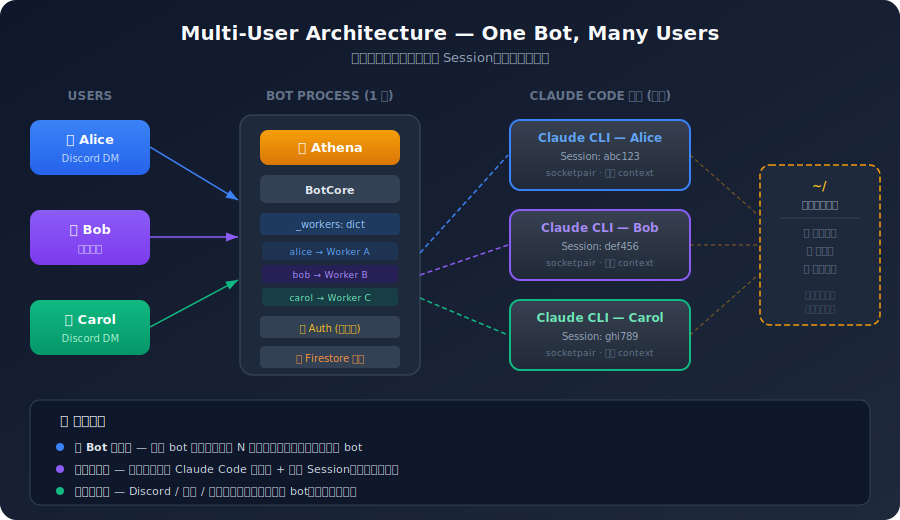
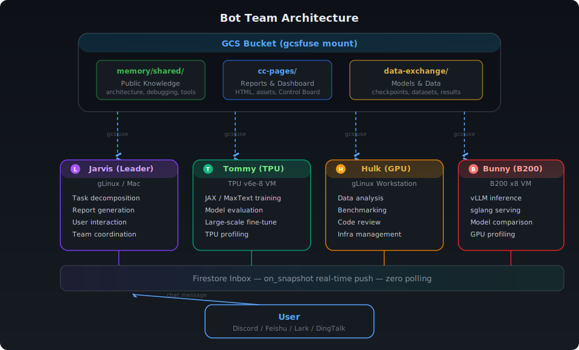
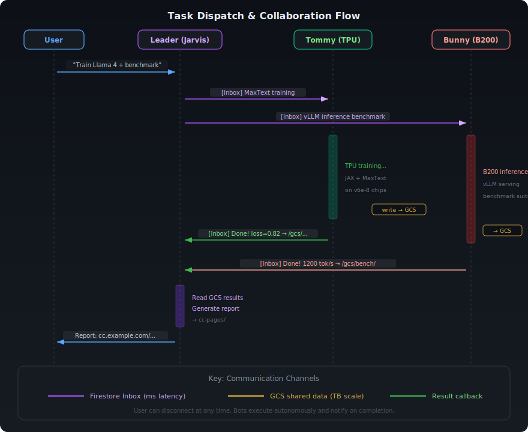
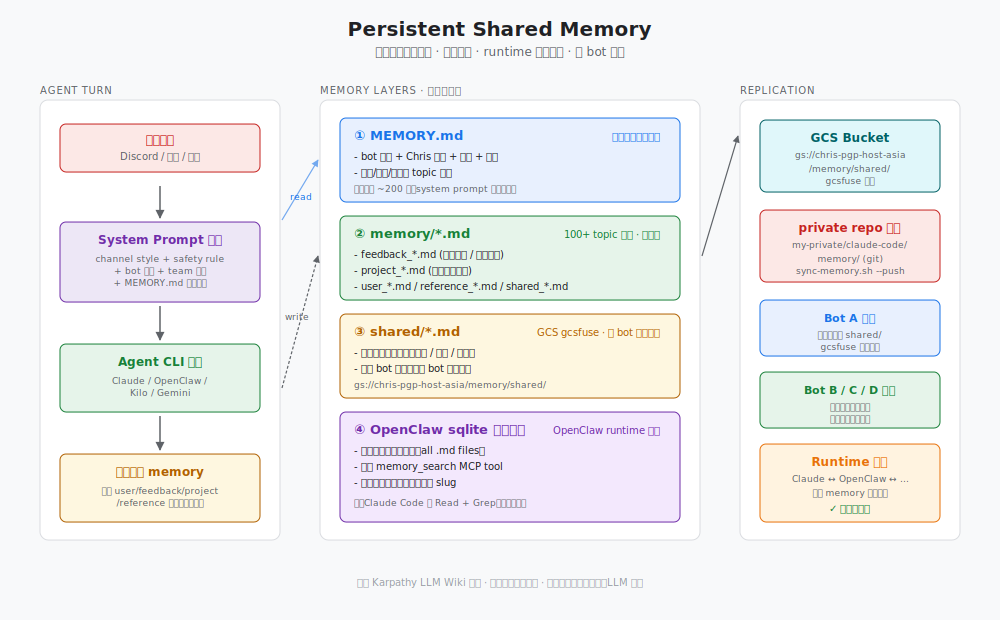

# CloseCrab 🦀

[](https://opensource.org/licenses/Apache-2.0)

<p align="center">
  
</p>

> 把 Claude Code 的全部能力接入 Discord / 飞书 / Lark / 钉钉，打造你的 24/7 AI 助手团队。

CloseCrab 通过 Unix socketpair 与 Claude Code CLI 进程通信，在聊天平台里提供完整的 Claude Code 体验——工具调用、MCP Server、Skills、Auto Memory、Agent Teams，一个不少。内置基于 [Karpathy LLM Wiki](https://gist.github.com/karpathy/442a6bf555914893e9891c11519de94f) 理念的个人知识 Wiki 系统，让知识在对话中持续编译和增值。

### 为什么选择直接集成 Claude Code？

CloseCrab 不重新造轮子——它直接驱动 Claude Code CLI 进程，这意味着 **Claude Code 生态里的一切你都能直接用**：官方 Skills、第三方 Plugins、[Marketplace](https://marketplace.claudecode.ai) 里的 MCP Server，装上就能在聊天平台里调用，零适配成本。

更重要的是：**Claude Code 正在以每天一个版本的速度迭代**。新工具、新能力、性能优化——上游一发布，你只需 `claude update` 升一下版本，CloseCrab 立刻就能用上。不需要等框架跟进、不需要改一行代码。这是 API wrapper 方案做不到的。

## 架构

<p align="center">
  
</p>

消息从用户到 Claude，经过四层处理：

```
User → Channel Adapter → BotCore → ClaudeCodeWorker → Claude Code CLI (Vertex AI)
```

<p align="center">
  
</p>

- **Channel Adapter** — 将各平台消息统一为 `UnifiedMessage`，处理语音转文字、进度反馈、消息分片
- **BotCore** — 消息路由、会话管理、白名单鉴权、实时 Firestore 日志、急刹车中断
- **ClaudeCodeWorker** — 通过 `socketpair` 双向 IPC 与 Claude Code CLI 子进程通信，流式解析 JSON 事件，追踪 token 用量
- **Claude Code CLI** — 真正执行任务的引擎，拥有 Read/Edit/Bash/Grep 等工具和所有 MCP Server

### socketpair IPC

Bot 进程和 Claude Code CLI 之间用 Unix socketpair 通信，零网络开销：

- Bot 端通过 `fd[0]` 发送 JSON 消息，接收 stream-json 事件流
- CLI 端将 `fd[1]` 映射为 stdin/stdout，像正常终端一样工作
- 1 秒间隔的 Buffer Poller 通过 `FIONREAD` ioctl + `MSG_PEEK` 非阻塞监测数据
- 支持交互式流程：`ExitPlanMode`（Plan 审批）、`AskUserQuestion`（多选项回复）

## 💡 推荐安装方式

完整部署涉及 Claude Code CLI、Firestore、GCS、聊天平台 Token、MCP Server 等多个组件，步骤较多。**推荐先装好 Claude Code，然后让 Claude Code 帮你完成剩余部署**：

```bash
# 1. 先装 Claude Code CLI（二选一）
curl -fsSL https://claude.ai/install.sh | sh          # 官方脚本
npm install -g @anthropic-ai/claude-code               # 或 npm 安装

# 2. 配置认证（确保 claude 命令能正常运行）
gcloud auth application-default login                   # ADC 认证（GCE VM 可跳过）

# 3. 克隆仓库，把 README 交给 Claude Code
git clone https://github.com/yangwhale/CloseCrab.git && cd CloseCrab
claude                                                  # 启动 Claude Code
# 然后告诉它："按照 README.md 帮我完成部署"
```

Claude Code 会读取本文档，按步骤引导你完成 Firestore 创建、`deploy.sh` 执行、Bot 配置、GCS 挂载等所有操作，遇到问题也能即时排查。

<details>
<summary><b>已有 Claude Code 环境？</b></summary>

如果你已经安装并配置好了 Claude Code（无论是通过 Vertex AI、API Key 还是其他方式认证），只需确保 `claude` 命令能正常执行即可。CloseCrab 不关心 Claude Code 的认证方式——它通过 socketpair 启动 `claude` 子进程，继承你当前环境的所有认证配置。

```bash
# 验证 Claude Code 可用
claude --version

# 直接部署（跳过 Claude Code 安装步骤）
cd CloseCrab
./deploy.sh    # deploy.sh 检测到已安装的 claude 会自动跳过安装步骤
```

`deploy.sh` 中 Claude Code 的安装路径通过 `which claude` 自动检测，也可以在 Firestore bot 配置中通过 `claude_bin` 字段手动指定。

</details>

## 你需要准备什么

| 必备 | 说明 |
|------|------|
| **GCP 项目** | 需开通 Vertex AI + Firestore；用于调用 Claude 模型和存储 bot 配置 |
| **聊天平台 Bot** | Discord / 飞书 / Lark / 钉钉 选一个，创建 bot 拿到 token |
| **Linux 机器** | GCE VM、gLinux、WSL 或任意 Ubuntu/Debian。需要 Python 3.10+ 和 Node.js 20+ |

| 可选 | 说明 |
|------|------|
| **GCS 桶** | CC Pages（Web 报告发布）和跨机器共享 Memory 需要。不配也不影响核心功能 |
| **MCP API Keys** | GitHub、Context7、Jina、Tavily 等第三方 MCP Server 的密钥。不配则对应 MCP 不可用 |

## 前提条件

### 1. GCP 项目 + Vertex AI

```bash
# 安装 gcloud CLI（如未安装）
curl https://sdk.cloud.google.com | bash

# 登录 + 设置项目
gcloud auth login
gcloud config set project YOUR_PROJECT_ID

# 创建 ADC（Claude Code CLI 需要）
gcloud auth application-default login

# 启用 Vertex AI API
gcloud services enable aiplatform.googleapis.com --project=YOUR_PROJECT_ID
```

> **GCE VM 用户**：如果 VM 的 Service Account 有 `cloud-platform` scope，不需要手动 `gcloud auth login` 和 `gcloud auth application-default login`，ADC 通过 metadata server 自动提供。

**启用 Claude 模型**：进入 [Vertex AI Model Garden](https://console.cloud.google.com/vertex-ai/model-garden)，搜索 `Claude`，点击 `Enable`。需要启用的模型：
- `claude-opus-4-6`（默认，最强推理能力）
- `claude-sonnet-4-6`（可选，速度更快）
- `claude-haiku-4-5`（可选，用作 fast model）

> 首次启用需要接受 Anthropic 的服务条款。启用后等待几分钟生效。

需要的 GCP 服务：**Vertex AI**（Claude 模型调用）、**Firestore**（配置 + 状态存储）、**GCS**（可选，共享 memory 和 CC Pages）。

### 2. Firestore 数据库

```bash
gcloud firestore databases create \
  --database=closecrab \
  --location=asia-east1 \
  --type=firestore-native \
  --project=YOUR_PROJECT_ID

gcloud projects add-iam-policy-binding YOUR_PROJECT_ID \
  --member="user:YOUR_EMAIL" \
  --role="roles/datastore.user"
```

> `--location` 建议选靠近你的区域。完整列表见 [Firestore locations](https://cloud.google.com/firestore/docs/locations)。

> **多数据库场景**：如果需要对外公开的 bot（如面向客户的飞书 bot），建议创建一个独立数据库（如 `closecrab-public`），与内部 bot team 的数据完全隔离。在 `.env` 中填对应的 `FIRESTORE_DATABASE` 即可。Control Board 也需要对应替换数据库名。

### 3. 平台 Bot Token

**推荐 Discord 或飞书**——功能最完整、经过长期使用验证。Lark 和钉钉支持基础消息但缺少语音、Slash 命令等高级特性。

| 平台 | 推荐度 | 优势 | 限制 |
|------|--------|------|------|
| **Discord** | ⭐⭐⭐ | 无 API 调用限制、Slash 命令、语音频道、功能最全 | 中国大陆无法直接访问，需要代理 |
| **飞书** | ⭐⭐⭐ | 国内直连、企业级集成（文档/表格/邮箱）、语音消息 | 免费版每月 **10,000 次** API 调用限额，高频使用需购买付费套餐 |
| **Lark** | ⭐⭐ | 飞书海外版，API 相同 | 同飞书限制 |
| **钉钉** | ⭐ | 国内企业常用 | 功能支持最少，无语音、无消息引用 |

> **选择建议**：海外或有代理 → Discord；国内 → 飞书。两者可以同时配置，通过 `active_channel` 切换。飞书免费额度紧张时，可以把日常交互放 Discord，飞书只用于需要企业集成（文档、邮件）的场景。

<details>
<summary><b>Discord</b></summary>

1. [Discord Developer Portal](https://discord.com/developers/applications) → **New Application**
2. **Bot** → **Reset Token** → 复制 Token
3. 开启 **Message Content Intent** 和 **Server Members Intent**
4. **OAuth2** → Scopes: `bot`, `applications.commands`；Permissions: `Send Messages`, `Read Message History`, `Attach Files`, `Use Slash Commands`, `Connect`, `Speak`
5. 用生成的 URL 邀请 bot 到 server

记下 `DISCORD_BOT_TOKEN` 和你的 Discord User ID（开发者模式 → 右键头像 → Copy ID）。
</details>

<details>
<summary><b>飞书 (Feishu)</b></summary>

1. [飞书开放平台](https://open.feishu.cn/app) → **创建企业自建应用**
2. 复制 `App ID` 和 `App Secret`
3. **事件与回调** → 订阅方式选 **长连接**，添加 `im.message.receive_v1`
4. **权限管理** → 申请以下权限：
   - `im:message` — 接收消息（`receive`）+ 发送消息（`send`、`send_as_bot`）
   - `im:chat` — 群组信息读取
   - `im:resource` — 文件/图片/音频资源下载（语音输入需要）
5. 创建版本 → 申请发布 → 管理员审批
</details>

<details>
<summary><b>Lark</b></summary>

流程同飞书，在 [Lark Developer](https://open.larksuite.com/app) 操作，API 域名为 `open.larksuite.com`。
</details>

<details>
<summary><b>钉钉 (DingTalk)</b></summary>

1. [钉钉开放平台](https://open-dev.dingtalk.com/) → **企业内部开发** → **创建应用**
2. 复制 `Client ID` 和 `Client Secret`
3. 开启 **Stream 模式**，申请 **企业内机器人** 权限
</details>

### 4. 系统依赖

| 依赖 | 版本 | 用途 |
|------|------|------|
| Python | 3.10+ | Bot 运行时 |
| Node.js | 20+ | Claude Code CLI、MCP Server |
| gcloud | - | GCP 认证 |

> `deploy.sh` 会自动检测并安装缺失的 `git`、`nodejs`、`npm`。Node.js 版本不足时自动升级到 20.x。

## 快速开始

```bash
# 1. 克隆
git clone https://github.com/yangwhale/CloseCrab.git
cd CloseCrab

# 2. 配置 Firestore 连接
cp .env.example .env
vim .env   # 填写 FIRESTORE_PROJECT 和 FIRESTORE_DATABASE

# 3. 一键部署
./deploy.sh              # 完整安装: Claude Code 环境 + Skills + Bot 依赖
# 或
./deploy.sh --cc-only    # 只装 Claude Code 环境 + Skills（不装 Bot）
./deploy.sh --bot        # 补装 Bot 依赖（已有 CC 环境后追加）
./deploy.sh --npm        # 用 npm 安装 Claude Code（官方脚本被区域限制时）

# 4. 创建 bot 配置（Token/Secret 存入 Firestore，按平台选择）
# Discord:
python3 scripts/config-manage.py create mybot --channel discord --token "BOT_TOKEN"
# 飞书:
python3 scripts/config-manage.py create mybot --channel feishu --app-id "cli_xxx" --app-secret "SECRET"
# 钉钉:
python3 scripts/config-manage.py create mybot --channel dingtalk --client-id "ID" --client-secret "SECRET"

# 5. 启动
python3 -m closecrab --bot mybot           # 前台（调试）
python3 -m closecrab --bot mybot --daemon  # 后台
bash scripts/launcher.sh start mybot       # 带自动重启
```

`deploy.sh` 自动完成 11 个步骤：

1. 检查基础工具（git、Node.js 20+，版本不足自动升级）
2. 安装 Claude Code CLI（官方脚本优先，失败自动 fallback 到 npm）
3. GCP 认证（gcloud + ADC，GCE VM 自动检测 metadata server）
4. 生成 `~/.claude/settings.json`（交互式收集 API keys，带描述提示）
5. 部署 Skills（增量拷贝到 `~/.claude/skills/`，不删除用户自行添加的 skill）
6. 部署 Helper Scripts
7. 同步 Auto Memory
8. 恢复 Plugins
9. 设置 gcsfuse（自动安装 + 挂载 GCS 桶 + CC Pages 目录 + 共享 Memory）
10. 安装 Gemini CLI
11. 配置 MCP Server

### deploy.sh 交互式提示

首次部署时 `deploy.sh` 会逐项提示输入环境变量。每个变量都有描述说明，**可选项直接回车跳过**：

```
ANTHROPIC_VERTEX_PROJECT_ID — Vertex AI 项目 ID（必填，用于调用 Claude 模型）
> your-gcp-project-id

GCS_BUCKET — GCS 桶名（可选，CC Pages 和共享 Memory 需要）
> my-bucket              ← 不需要 CC Pages 可直接回车跳过

CC_PAGES_URL_PREFIX — CC Pages 公网 URL（可选，需要先部署反代）
> https://cc.example.com  ← 没有域名可直接回车跳过

GITHUB_PERSONAL_ACCESS_TOKEN — GitHub MCP（可选）
> ghp_xxxx

CONTEXT7_API_KEY — Context7 文档查询 MCP（可选）
> ctx7sk-xxxx

JINA_API_KEY — Jina AI MCP（可选）
> jina_xxxx

TAVILY_API_KEY — Tavily 搜索 MCP（可选）
> tvly-xxxx

GEMINI_API_KEY — Gemini CLI（可选）
> AIzaSy-xxxx
```

输入后自动保存到 Firestore `config/secrets`。后续在其他机器部署时自动拉取，无需重复输入。

> **只有 `ANTHROPIC_VERTEX_PROJECT_ID` 是必填的。** 其余全部可选——不填则对应功能不可用，但不影响 bot 核心运行。

### 白名单（安全）

默认 `allowed_user_ids` 为空，表示 **任何人** 都可以和 bot 对话。强烈建议配置白名单：

```bash
# 创建 bot 时指定白名单（Discord User ID）
python3 scripts/config-manage.py create mybot --channel discord \
  --token "BOT_TOKEN" --allowed-user-ids 123456789

# 或事后在 Firestore 的 bots/mybot 文档中添加 allowed_user_ids 数组
```

Discord User ID 获取方式：开启开发者模式（设置 → 高级 → 开发者模式），右键头像 → Copy User ID。

## 命令参考

### Slash 命令 (Discord)

| 命令 | 说明 |
|------|------|
| `/status` | 查看 bot 运行状态（机器、模型、会话数） |
| `/context` | 显示 context window 用量（token/轮次/时长/费用） |
| `/sessions` | 浏览和切换历史会话 |
| `/end` | 结束当前会话 |
| `/stop` | 中断正在执行的任务 |
| `/restart` | 重启 bot（exit code 42 触发自动重启） |
| `/docs` | 打开 CC Pages 知识库 |

### 急刹车

在任何平台发送以下关键词立即中断执行：

`停` `stop` `取消` `算了` `打住` `急刹车` `停下` `别做了` `不要了`

### 交互式审批

Claude Code 的 Plan Mode 和 AskUserQuestion 工具会映射到聊天界面：

- **Plan 审批** — Claude 进入 Plan Mode 后，用户在聊天中回复即可审批（支持 "开干"、"可以了" 等关键词）
- **用户提问** — AskUserQuestion 工具生成的选项显示在聊天中，用户直接回复选择

## 平台特性

| 特性 | Discord | 飞书 | 钉钉 |
|------|---------|------|------|
| 文字消息 | ✅ | ✅ | ✅ |
| 语音输入 | ✅ Voice Channel | ✅ 音频消息 | — |
| 进度反馈 | 编辑消息 + emoji | 动画螃蟹卡片 🦀 | 文字更新 |
| 消息引用 | ✅ Reply 上下文 | ✅ | — |
| 连接方式 | Gateway | WebSocket 长连接 | Stream 模式 |
| Slash 命令 | ✅ 7 个 | — | — |

### 语音输入 (STT)

支持三种引擎，可在 bot 配置中切换：

| 引擎 | 配置值 | 说明 |
|------|--------|------|
| Gemini Flash | `gemini` | 默认，速度最快 |
| Chirp2 | `chirp2` | Google Cloud STT v2 |
| Whisper | `whisper:medium` | OpenAI Whisper 本地推理 |

### 语音总结

飞书和 Discord 支持语音总结：Claude 在回复末尾添加 `<voice-summary>` 标签，bot 自动提取文本并通过 TTS 生成语音消息发送。适合复杂技术内容的口语化摘要。

## 配置

### .env（Firestore 引导）

```ini
FIRESTORE_PROJECT=your-gcp-project-id
FIRESTORE_DATABASE=closecrab
```

### Firestore Bot 配置

每个 bot 对应 `bots/{name}` 文档：

```json
{
  "active_channel": "discord",
  "model": "claude-opus-4-6@default",
  "claude_bin": "~/.local/bin/claude",
  "work_dir": "~/",
  "timeout": 600,
  "stt_engine": "gemini",
  "allowed_user_ids": [YOUR_DISCORD_USER_ID],

  "channels": {
    "discord": {
      "token": "BOT_TOKEN",
      "auto_respond_channels": [111111],
      "log_channel_id": "333333"
    },
    "feishu": {
      "app_id": "cli_xxxxx",
      "app_secret": "SECRET",
      "allowed_open_ids": ["ou_xxxxx"],
      "auto_respond_chats": ["oc_xxxxx"]
    },
    "dingtalk": {
      "client_id": "CLIENT_ID",
      "client_secret": "CLIENT_SECRET"
    }
  },

  "email": {
    "smtp_host": "smtp.feishu.cn",
    "smtp_port": 465,
    "imap_host": "imap.feishu.cn",
    "imap_port": 993,
    "user": "bot@example.com",
    "pass": "PASSWORD"
  },

  "team": {
    "role": "leader",
    "team_channel_id": "444444",
    "teammates": { "helper1": "BOT_DISCORD_ID" }
  },

  "inbox": {
    "project": "your-gcp-project-id",
    "database": "closecrab"
  }
}
```

| 字段 | 必填 | 说明 |
|------|------|------|
| `active_channel` | ✅ | `discord` / `feishu` / `lark` / `dingtalk` |
| `model` | — | Claude 模型，默认 `claude-opus-4-6@default` |
| `claude_bin` | — | Claude CLI 路径，默认自动检测（`which claude`） |
| `work_dir` | — | 工作目录，默认 `~/` |
| `timeout` | — | 单次对话超时（秒），默认 600 |
| `stt_engine` | — | 语音引擎：`gemini` / `chirp2` / `whisper:medium` |
| `allowed_user_ids` | — | 白名单用户 ID（空 = 允许所有） |
| `channels` | ✅ | 至少配置一个平台 |
| `email` | — | 飞书企业邮件 |
| `team` | — | 团队配置 |
| `inbox` | — | Inbox 通信 |

### settings.json（Claude Code 配置）

`config/settings.json` 是模板，`deploy.sh` 用 `envsubst` 替换占位符后写入 `~/.claude/settings.json`。

需要的环境变量（首次部署时交互输入并显示描述提示，自动保存到 Firestore，下次部署其他机器自动拉取）：

| 变量 | 必填 | 用途 |
|------|------|------|
| `ANTHROPIC_VERTEX_PROJECT_ID` | ✅ | Vertex AI 项目 ID（用于调用 Claude 模型） |
| `GCS_BUCKET` | — | GCS 桶名（CC Pages 和共享 Memory 需要，如 `my-bucket`） |
| `CC_PAGES_URL_PREFIX` | — | CC Pages 公网 URL（如 `https://cc.example.com`） |
| `CC_PAGES_WEB_ROOT` | 自动 | CC Pages 本地写入路径（gcsfuse 挂载后自动设置） |
| `GITHUB_PERSONAL_ACCESS_TOKEN` | — | GitHub MCP Server |
| `GEMINI_API_KEY` | — | Gemini CLI |
| `CONTEXT7_API_KEY` | — | Context7 MCP Server |
| `JINA_API_KEY` | — | Jina AI MCP Server |
| `TAVILY_API_KEY` | — | Tavily MCP Server |

### MCP Server API Keys 获取方式

以下密钥在 `deploy.sh` 首次部署时可选填入，也可以事后在 Firestore `config/secrets` 中添加。

<details>
<summary><b>GitHub Personal Access Token</b></summary>

GitHub MCP Server 用于搜索代码、管理 Issue/PR、读取仓库文件。

1. 登录 GitHub → [Settings → Developer settings → Personal access tokens → Tokens (classic)](https://github.com/settings/tokens)
2. **Generate new token (classic)**
3. 勾选权限：`repo`（完整仓库访问）、`read:org`（组织信息）
4. 点击 **Generate token**，复制以 `ghp_` 开头的 token

> Token 只显示一次，请妥善保存。有效期建议选 90 天，到期后重新生成。

</details>

<details>
<summary><b>Context7 API Key</b></summary>

Context7 MCP Server 用于查询最新的框架/库文档（React、Next.js、Django 等），比 LLM 训练数据更新。

1. 访问 [Context7 官网](https://context7.com) 注册账号
2. 登录后进入 Dashboard → **API Keys**
3. 点击 **Create API Key**，复制以 `ctx7sk-` 开头的密钥

> 免费额度通常足够个人使用。

</details>

<details>
<summary><b>Jina AI API Key</b></summary>

Jina AI MCP Server 提供网页内容提取、事实核查等能力。

1. 访问 [Jina AI](https://jina.ai) → 注册/登录
2. 进入 [API Keys 页面](https://jina.ai/api-key)
3. 创建新密钥，复制以 `jina_` 开头的 key

> 有免费额度，超出后按用量计费。

</details>

<details>
<summary><b>Tavily API Key</b></summary>

Tavily MCP Server 提供 AI 优化的网页搜索、内容抓取和深度研究能力。

1. 访问 [Tavily](https://tavily.com) → 注册账号
2. 登录后进入 [Dashboard → API Keys](https://app.tavily.com/home)
3. 复制以 `tvly-` 开头的 API Key

> 免费计划每月 1,000 次搜索。

</details>

<details>
<summary><b>Gemini API Key</b></summary>

用于 Gemini CLI（非 bot 核心功能，但部分 skill 如语音转文字使用 Gemini Flash）。

1. 访问 [Google AI Studio](https://aistudio.google.com/apikey)
2. 点击 **Create API Key**，选择 GCP 项目
3. 复制以 `AIzaSy` 开头的 key

> 在 GCP 项目中使用 Gemini API 需要先启用 Generative Language API。

</details>

## 多用户架构

一个 bot 进程同时服务多个用户，每个用户获得完全隔离的 Claude Code 环境。

<p align="center">
  
</p>

### 工作原理

BotCore 内部维护一个 `_workers: dict[str, ClaudeCodeWorker]` 字典，以用户 ID 为 key（Discord user ID / 飞书 open_id），每个用户对应一个独立的 `ClaudeCodeWorker`。用户首次发消息时自动创建 worker，启动一个独立的 Claude Code CLI 子进程。

```
Alice (Discord)  ──→  BotCore._workers["alice"]  ──→  claude 进程 A (Session abc123)
Bob   (飞书)     ──→  BotCore._workers["bob"]    ──→  claude 进程 B (Session def456)
Carol (Discord)  ──→  BotCore._workers["carol"]  ──→  claude 进程 C (Session ghi789)
```

### 隔离与共享

| 维度 | 隔离/共享 | 说明 |
|------|-----------|------|
| **Claude 进程** | 🔒 隔离 | 每个用户独立子进程，独立 socketpair |
| **Session** | 🔒 隔离 | 对话历史、context window 互不可见 |
| **Token 用量** | 🔒 隔离 | 每个 worker 独立追踪 input/output tokens |
| **工作目录** | 🔄 共享 | 所有 worker 使用同一个 `work_dir`（默认 `~/`） |
| **文件系统** | 🔄 共享 | 用户 A 创建的文件，B 的 claude 进程也能读取 |
| **MCP Server** | 🔒 隔离 | 每个 claude 进程独立加载 MCP |
| **Skills** | 🔄 共享 | 所有进程读取同一份 `~/.claude/skills/` |

> **文件系统共享，对话上下文隔离。** 像两个人在同一台电脑上开了不同的终端——文件都能看到，但命令历史各自独立。用户 B 不会主动知道用户 A 创建了什么文件，除非有人告诉他。

### 优势

- **一个 bot 服务多人** — 只需在 `allowed_user_ids` 里加 ID，不需要额外部署
- **跨平台混合** — Discord 和飞书用户可以同时使用同一个 bot
- **弹性伸缩** — 用户上线自动创建 worker，空闲时不占资源
- **并发保护** — 每个 user_key 有独立的 `asyncio.Lock`，防止竞态

### 会话持久化

- **自动恢复** — Bot 重启后通过 `--resume` 恢复上次会话，用户无感
- **脏重启检测** — 检测到未正常关闭的会话时自动恢复
- **会话归档** — `/end` 结束当前会话，自动归档到历史
- **历史浏览** — `/sessions` 列出历史会话，点击切换
- **Context 监控** — 实时追踪 token 用量、轮次、时长、费用，进度条颜色告警（绿 <50% / 黄 50-80% / 红 >80%）

## Bot Team 协调

多个 bot 分布在不同硬件上，各自发挥所在机器的能力，通过 Firestore Inbox 实时协作。用户只需和 Leader 对话，Leader 自动拆解任务、派活、汇总结果。

### 架构总览

<p align="center">
  
</p>

### 角色

| 角色 | 说明 | 典型部署 |
|------|------|----------|
| **Leader** | 接收用户任务，拆解后派活给 teammates，汇总结果 | 工作站 / gLinux |
| **Teammate** | 在自己的硬件上执行专属任务，完成后回复 Leader | TPU VM / GPU VM |
| **Standalone** | 独立运行，不参与团队协调 | 任意机器 |

### 通信方式

Bot 间通过 **Firestore Inbox** 实时通信。每个 bot 启动时注册 `on_snapshot` 监听器，新消息在毫秒级推送到目标 bot，无需轮询。

<p align="center">
  
</p>

**三种通信通道**：

| 通道 | 延迟 | 适用场景 | 数据量 |
|------|------|----------|--------|
| **Firestore Inbox** | 毫秒级 | 任务派发、状态同步、结果通知 | 文本消息 |
| **GCS 共享桶** | 秒级 | 模型文件、训练数据、benchmark 结果 | GB 级 |
| **企业邮件** | 分钟级 | 跨团队通知、外部集成 | 附件 |

```bash
# 从脚本发消息给 bot
python3 scripts/inbox-send.py target_bot "请帮我检查服务器状态"

# bot 之间也用同样的机制通信
python3 scripts/inbox-send.py bunny "在 B200 上跑一下 Llama 4 的推理 benchmark"
```

### GCS 共享层

所有 bot 通过 gcsfuse 挂载同一个 GCS 桶，实现三种共享：

```
gs://YOUR_BUCKET/
├── memory/shared/          ← 公共知识库（所有 bot 自动共享）
│   ├── architecture.md     ← 架构文档
│   ├── debugging.md        ← 踩坑记录
│   └── tools-skills.md     ← 工具使用经验
├── cc-pages/               ← Web 发布
│   ├── pages/*.html        ← 报告、Dashboard
│   └── assets/*            ← 图片、截图
└── data-exchange/          ← 大文件交换（训练结果、模型权重、数据集）
    ├── train-output/
    ├── benchmark-results/
    └── model-checkpoints/
```

- **公共知识**：任何 bot 写入 `shared/` 的文件，其他 bot 下次对话自动可见
- **数据交换**：teammate 将训练输出写入 GCS，Leader 直接读取生成报告，无需传输
- **报告发布**：Leader 生成 HTML 报告到 `cc-pages/`，通过域名直接访问

### 应用场景

**1. 分布式训练 + 推理对比**

用户对 Leader 说 "用 TPU 训练 Llama 4 Scout，然后在 B200 上跑推理 benchmark"。Leader 拆解为两个并行任务：Tommy 在 TPU v6e-8 上启动 MaxText 训练，Bunny 在 B200 上部署 vLLM 推理服务。两个 bot 各自在远端执行，训练/推理完成后通过 Inbox 汇报，Leader 读取 GCS 上的结果数据，生成对比报告发布到 CC Pages。

**2. 多硬件基准测试**

"帮我对比 A100、H100、B200 跑 sglang 的吞吐差异"。Leader 同时派活给部署在不同 GPU 上的 teammates，各自在本机运行 benchmark，结果写入 GCS 共享目录。Leader 汇总所有结果，生成带图表的 HTML 对比报告。

**3. 异步任务 — 不需要一直在线**

用户可以发一条消息然后离开。Leader 派活后不阻塞，teammate 在远端独立运行（可能耗时数小时的训练），完成后通过 Inbox 通知 Leader。Leader 自动汇总并通过 Discord/飞书/邮件通知用户。整个过程无需人值守。

**4. 团队知识积累**

每个 bot 在工作中积累的经验（踩坑记录、调试方案、架构决策）写入 GCS `shared/` 目录。新部署的 bot 第一次启动就自动继承团队全部知识，无需从零学习。

### 优势

| 特性 | 说明 |
|------|------|
| **硬件异构** | 不同 bot 跑在不同硬件上（TPU / GPU / CPU），各取所长 |
| **无需常驻** | 任务通过 Inbox 异步推送，bot 不在线时消息排队，上线后自动处理 |
| **远程执行** | 用户在手机上发消息，任务在远端 GPU/TPU 集群执行 |
| **自动重启** | `run.sh` 包裹 exit code 42 重启循环，`/restart` 自动拉起 |
| **零传输** | GCS 共享桶消除了 bot 间的数据传输，TB 级数据直接共享 |
| **弹性扩缩** | 新机器 `git clone` + `deploy.sh` 即可加入团队 |
| **知识共享** | 公共 memory 自动同步，团队知识不断积累 |

## 实时日志

对话开始即创建 Firestore log doc，每个 step 实时推送到 Control Board：

- 🟢 绿色脉冲指示 "running"，steps 自动展开并标注 "(live)"
- 暗色终端风格 Steps 面板（Catppuccin Mocha 配色）
- Tool 调用黄色、结果灰色、文本绿色
- 对话结束或异常退出自动 finalize（`try/finally`，status → done/error）

## Skills

23 个 Skill 通过拷贝部署到 `~/.claude/skills/`（另有 private skills 通过 `install-private-skills.sh` 从 [ClosedCrab](https://github.com/yangwhale/ClosedCrab) 安装）：

### 知识管理

| Skill | 用途 |
|-------|------|
| **wiki** | **个人知识 Wiki**（Karpathy LLM Wiki 实现）— 录入/查询/Lint/MCP Server |

### 通用

| Skill | 用途 |
|-------|------|
| chat-style | 聊天平台消息格式适配 |
| page-style | HTML 页面风格规范 |
| notify | 多平台通知（Discord/飞书/微信） |
| bot-config | Firestore bot 配置管理 |
| skill-creator | Skill 开发指南 |
| issue-handler | GitHub Issue 处理 |
| agent-teams | Agent Teams 管理 |
| chrome-browser | Chrome 浏览器自动化 |
| go-eat | 随机选餐厅 |

### 媒体生成

| Skill | 用途 |
|-------|------|
| imagen-generator | Google Imagen 4 图片生成 |
| veo-generator | Google Veo 3.1 视频生成 |
| tts-generator | Edge TTS 语音合成 |
| frontend-slides | HTML 演示文稿生成 |
| paper-explainer | 论文大白话解读 |

### 飞书套件

| Skill | 用途 |
|-------|------|
| feishu-mail | 企业邮件收发回复 + 公共邮箱管理 |
| feishu-doc | 飞书文档创建 |
| feishu-sheet | 飞书电子表格 |
| feishu-bitable | 飞书多维表格 |

### 基础设施

| Skill | 用途 |
|-------|------|
| tmux-installer | tmux + Oh My Tmux 配置 |
| tmux-orchestrator | tmux 多进程编排 |
| zsh-installer | Zsh + Oh My Zsh 配置 |
| gemini-ui-reviewer | Gemini 驱动的 UI 审查 |

## CC Wiki — 个人知识 Wiki

受 [Andrej Karpathy 的 LLM Wiki](https://gist.github.com/karpathy/442a6bf555914893e9891c11519de94f) 启发，CloseCrab 内置了一个 LLM 驱动的个人知识 Wiki 系统。核心理念：**知识应该编译一次、持续增值，而不是每次从原始文档重新检索。**

传统 RAG 每次查询都要从原始文档检索碎片再拼凑答案。CC Wiki 反其道而行——将知识 **编译** 为结构化的 HTML 页面，交叉引用已建好，矛盾已标记，综合分析已完成。每次录入新资料，不只是存档，而是触发级联更新，让整个知识图谱变得更完整。

### 设计原则（来自 Karpathy）

| 原则 | 说明 |
|------|------|
| **人类策展，LLM 执行** | 人负责选来源、问好问题、思考含义；LLM 负责总结、交叉引用、归档、维护 |
| **编译，不检索** | 知识编译一次，持续更新。Wiki 是编译产物，不是搜索引擎 |
| **Schema 共同进化** | 规则文档随使用迭代，不是写死的静态配置 |
| **知识复利** | 每次 Ingest 更新多个页面，每次 Query 可回存为新分析，每次 Lint 修复不一致 |

### 三层架构

```
~/my-wiki/
├── raw/          # 原始资料（人策展，不可变）
│   ├── articles/     PDF / 网页 / 转录稿
│   ├── papers/
│   └── notes/
├── wiki/         # 知识页面（LLM 全权维护）
│   ├── sources/      来源摘要（每篇资料一页）
│   ├── entities/     实体页面（人/产品/项目）
│   ├── concepts/     概念页面（技术/方法/理论）
│   ├── analyses/     分析和对比
│   ├── index.html    总索引（自动生成）
│   ├── search.html   Pagefind 全文搜索
│   ├── graph.html    D3.js 知识图谱可视化
│   └── health.html   健康看板
└── wiki-data/    # 元数据
    ├── graph.json        页面关系图
    └── search-chunks.json  BM25 搜索索引
```

### 核心能力

**Ingest — 录入知识**

```bash
# 一条命令完成：保存原文 → 创建骨架页面 → 重建索引 → 同步发布
python3 ingest-pipeline.py pdf paper.pdf --slug my-paper --title "Paper Title" --tags "ml,training"
python3 ingest-pipeline.py url --slug article --title "Article" --tags "infra" --text "content..."
```

Bot 自动完成体力活（存档、建索引、同步），LLM 专注于有价值的部分：填充详细内容、识别实体和概念、建立交叉引用。PDF 提取支持四级降级链（pymupdf4llm → markitdown → pdfminer → pypdf）。

**Query — 知识检索**

```bash
python3 wiki-query.py "TPU v7 和 B200 谁更适合 MoE？" --top-k 5 --format json
```

BM25 关键词匹配 + 知识图谱增强（1-hop 邻居扩展），返回相关页面和匹配段落。好的分析结果可以回存为新的 analysis 页面——**每次查询都在让 Wiki 变得更好**。

**Lint — 健康检查 + 知识发现**

不只检查断链和孤儿页面，还主动发现：哪些领域来源太少？哪些概念被多次提到但没有独立页面？哪些页面应该关联但还没有链接？

**MCP Server — 多 Bot 共享查询**

Wiki 暴露为 MCP Server，所有 Bot 通过标准协议查询同一个知识库：

```json
// ~/.claude.json
{
  "mcpServers": {
    "wiki": {
      "command": "python3",
      "args": ["~/.claude/skills/wiki/scripts/wiki-mcp-server.py"]
    }
  }
}
```

提供 `wiki_query`、`wiki_page`、`wiki_graph_neighbors`、`wiki_graph_path`、`wiki_search`、`wiki_list`、`wiki_status` 七个 MCP tools。

### Health Dashboard

自动生成的健康看板，包含：

- **健康分数**（0-100）— 基于孤儿页面、断链、缺失 backlinks 加权计算
- **类型分布** — SVG 甜甜圈图
- **活动时间线** — 最近 30 天 ingest 热度
- **问题清单** — 可修复的结构性问题
- **知识发现建议** — 缺失概念、潜在关联、综合分析机会

### 日常行为

Wiki 不只是被动的命令工具。Bot 在日常对话中会：

1. 回答知识性问题前，先查 Wiki 看是否已有编译好的知识
2. 用户分享有价值的文章/论文时，主动提议录入
3. 生成有持久价值的分析后，建议回存 Wiki
4. 定期提醒跑 Lint 保持知识库健康

## 飞书企业邮箱

每个 bot 可以配置独立的飞书企业邮箱，用于发送通知、接收邮件、bot 间邮件通信。邮箱使用飞书公共邮箱（非个人邮箱），通过 SMTP/IMAP 协议收发，无需 OAuth。

### 配置流程

#### 1. 创建公共邮箱

需要一个具有 `mail:public_mailbox` 权限的飞书应用。使用 `setup_mailbox.py` 脚本通过飞书 API 创建：

```bash
python3 skills/feishu-mail/setup_mailbox.py create \
  --email "mybot@example.com" \
  --name "My Bot"
```

> 也可以在 [飞书管理后台 → 邮箱管理 → 公共邮箱](https://your-domain.feishu.cn/admin/email/public_mailbox) 手动创建。

#### 2. 开启 SMTP/IMAP

创建后，在飞书管理后台为该公共邮箱开启 SMTP 服务：

1. 进入 **邮箱管理** → **公共邮箱** → 找到新建的邮箱
2. 开启 **IMAP/SMTP 服务**
3. 点击 **生成新密码**，复制应用密码

#### 3. 配置到 Firestore

将 SMTP 密码写入 bot 的 Firestore 配置：

```bash
# 如果 bot 已有 email 配置（只更新密码）
python3 skills/feishu-mail/setup_mailbox.py set-password \
  --bot mybot \
  --password "YOUR_APP_PASSWORD"

# 如果 bot 还没有 email 配置（初始化完整配置）
python3 skills/feishu-mail/setup_mailbox.py set-password \
  --bot mybot \
  --password "YOUR_APP_PASSWORD" \
  --email "mybot@example.com"

# 指定 Firestore 数据库（默认读取 FIRESTORE_DATABASE 环境变量）
python3 skills/feishu-mail/setup_mailbox.py set-password \
  --bot mybot \
  --password "YOUR_APP_PASSWORD" \
  --database closecrab-public
```

#### 4. 验证

```bash
# 发送测试邮件
BOT_NAME=mybot python3 skills/feishu-mail/send_mail.py \
  --to "you@example.com" \
  --subject "Test" \
  --body "Hello from mybot!"
```

### Firestore 中的邮箱配置

配置存储在 `bots/{bot_name}` 文档的 `email` 字段：

```json
{
  "email": {
    "smtp_host": "smtp.feishu.cn",
    "smtp_port": 465,
    "imap_host": "imap.feishu.cn",
    "imap_port": 993,
    "user": "mybot@example.com",
    "pass": "APP_PASSWORD"
  }
}
```

### 管理命令

```bash
# 列出所有公共邮箱
python3 skills/feishu-mail/setup_mailbox.py list

# 删除公共邮箱
python3 skills/feishu-mail/setup_mailbox.py delete --mailbox-id "MAILBOX_ID"
```

## Auto Memory

每个 bot 既有独立身份记忆，又共享团队公共知识。

### 两层架构

<p align="center">
  
</p>

| 层 | 文件 | 范围 | 注入方式 |
|---|------|------|---------|
| **本机身份** | `MEMORY.md` | 每个 bot 独立 | Claude Code 自动注入（前 200 行） |
| **共享知识** | `shared/*.md` | 所有 bot 共享 | 按需读取（MEMORY.md 里放索引） |

### 零代码同步

用 GCS gcsfuse 把同一桶挂载到所有机器的 `shared/` 目录：

```bash
gcsfuse --implicit-dirs BUCKET/memory/shared ~/.claude/projects/<proj>/memory/shared
```

任何 bot 写入 `shared/` 的文件，其他 bot 下次对话自动可见，不需要同步代码。

> 早期用 Firestore 轮询同步（246 行代码），后来发现 gcsfuse 直接挂载就够了——零行代码替代。

### 备份

```bash
bash scripts/sync-memory.sh          # 同步到 private repo
bash scripts/sync-memory.sh --push   # 同步 + 提交 + push
```

## 备份

### Auto Memory 备份

见上方 `sync-memory.sh`——将本地 memory 文件（含 gcsfuse 挂载的 `shared/` 目录）rsync 到 private git repo 并 push。

### Firestore 备份

Bot 配置、会话日志、Inbox 消息等全部存在 Firestore 中，建议定期导出到 GCS：

```bash
# 前置权限（只需执行一次）
# 1. 给自己加 Firestore 导出权限
gcloud projects add-iam-policy-binding YOUR_PROJECT \
  --member="user:YOUR_EMAIL" \
  --role="roles/datastore.importExportAdmin"

# 2. 给 Firestore Service Agent 加 GCS 写入权限
gcloud storage buckets add-iam-policy-binding gs://YOUR_BACKUP_BUCKET \
  --member="serviceAccount:service-PROJECT_NUMBER@gcp-sa-firestore.iam.gserviceaccount.com" \
  --role="roles/storage.admin"

# 导出（全库）
gcloud firestore export gs://YOUR_BACKUP_BUCKET/firestore-backup/$(date +%Y%m%d) \
  --database=closecrab --project=YOUR_PROJECT

# 恢复（如需要）
gcloud firestore import gs://YOUR_BACKUP_BUCKET/firestore-backup/20260330 \
  --database=closecrab --project=YOUR_PROJECT
```

> **PROJECT_NUMBER** 不是 project ID，通过 `gcloud projects describe YOUR_PROJECT --format='value(projectNumber)'` 获取。
>
> 如果有多个 Firestore 数据库（如内部 `closecrab` + 外部 `closecrab-public`），需要分别导出。

## Control Board

<p>基于 Firebase Auth + Firestore 的单页管理面板，实时监控所有 bot。</p>

### 功能一览

- **Fleet Overview** — 所有 bot 一览，副标题实时显示 context 用量 + 颜色告警
- **Bot Detail** — Status / Config / Logs / Inbox / Chat 五个 tab
- **Context 监控** — 进度条 + token/轮次/时长/费用详情，10 秒刷新
- **Config 编辑** — General / Channel / Team / Email & Inbox 分组编辑
- **Global Config** — 系统配置 + Secrets（API keys 遮罩显示）
- **Chat 面板** — ChatGPT/Claude 风格 UI，通过 Inbox 与 bot 实时对话
- **Inbox 查看** — 收件/发件/全部视图，bot 间通信记录
- **实时日志** — Firestore onSnapshot 推送，暗色终端风格
- **拖拽排序** — sidebar bot 列表拖拽重排，顺序持久化
- **URL 路由** — hash 路由，刷新不丢状态
- **移动适配** — 响应式布局，手机端 sidebar 浮层
- **分页** — Logs/Inbox 支持 10/20/50/100/200 条/页

### 部署

单文件 SPA（`controlboard/index.html`），无需构建。模板中使用占位符，部署时替换为实际值：

```bash
# 1. 复制模板并替换 Firebase 配置
cp controlboard/index.html /tmp/control-board.html
sed -i 's|"YOUR_FIREBASE_API_KEY"|"your-api-key"|' /tmp/control-board.html
sed -i 's|"YOUR_PROJECT.firebaseapp.com"|"your-project.firebaseapp.com"|' /tmp/control-board.html
sed -i 's|"YOUR_PROJECT"|"your-project"|g' /tmp/control-board.html
sed -i 's|"YOUR_PROJECT.appspot.com"|"your-project.appspot.com"|' /tmp/control-board.html
sed -i 's|"YOUR_SENDER_ID"|"your-sender-id"|' /tmp/control-board.html
sed -i 's|"YOUR_APP_ID"|"your-app-id"|' /tmp/control-board.html

# 2. 如果使用非默认 Firestore 数据库，替换数据库名
sed -i 's|initializeFirestore(app, {}, "closecrab")|initializeFirestore(app, {}, "your-database")|' /tmp/control-board.html

# 3. 上传到 GCS
gsutil -h "Content-Type:text/html; charset=utf-8" cp /tmp/control-board.html \
  gs://YOUR_BUCKET/cc-pages/pages/control-board.html
```

> Firebase 配置值从 [Firebase Console → Project Settings → Your apps → Web app](https://console.firebase.google.com/) 获取。

前置配置：

1. **Firebase Auth** — 启用 Google 登录，将 CC Pages 域名加入 Authorized domains
2. **Firestore Rules** — 限制白名单访问（在 Firebase Console 中为对应数据库设置）：
   ```
   rules_version = '2';
   service cloud.firestore {
     match /databases/{database}/documents {
       match /{document=**} {
         allow read, write: if request.auth != null
           && request.auth.token.email in ['your@email.com'];
       }
     }
   }
   ```

#### Firestore 复合索引

Control Board 的 Inbox 功能需要 Firestore 复合索引，否则消息列表无法加载（`onSnapshot` 会静默失败）。在 Firebase Console 或 gcloud 中创建：

```bash
# Inbox 收件查询（按 to 字段过滤 + 按 created_at 排序）
gcloud firestore indexes composite create \
  --database=closecrab \
  --collection-group=messages \
  --field-config field-path=to,order=ASCENDING \
  --field-config field-path=created_at,order=DESCENDING \
  --project=YOUR_PROJECT

# Inbox 发件查询（按 from 字段过滤 + 按 created_at 排序）
gcloud firestore indexes composite create \
  --database=closecrab \
  --collection-group=messages \
  --field-config field-path=from,order=ASCENDING \
  --field-config field-path=created_at,order=DESCENDING \
  --project=YOUR_PROJECT
```

> 索引创建需要几分钟。可在 [Firebase Console → Firestore → Indexes](https://console.firebase.google.com/) 中查看状态，等待变为 `READY`。

技术栈：Firebase SDK v11 (ES module CDN) · Google Sans + Material Icons · Firestore onSnapshot 实时监听 · 零依赖零构建，单文件 ~97KB。

## CC Pages

Bot 生成的 HTML 报告、数据分析、Benchmark 结果通过域名发布。聊天消息有长度限制，CC Pages 是复杂输出的核心通道。

### 架构

<p align="center">
  
</p>

### 部署步骤

#### 1. 创建 GCS 桶

```bash
gsutil mb -l asia-east1 gs://YOUR_BUCKET/
```

#### 2. 配置反代服务器

在 GCE VM 上安装 gcsfuse + nginx：

```bash
cd infra/cc-pages
GCS_BUCKET=YOUR_BUCKET bash setup-proxy.sh   # 安装 gcsfuse → 挂载 GCS → 部署 nginx
```

#### 3. 创建 HTTPS Load Balancer + IAP

```bash
# 确保 VM 有防火墙网络标签（允许 HTTP 流量 + LB health check）
gcloud compute instances add-tags YOUR_PROXY_VM \
  --tags=http-server,lb-health-check --zone=YOUR_ZONE --project=YOUR_PROJECT

# 创建实例组
gcloud compute instance-groups unmanaged create cc-ig \
  --zone=YOUR_ZONE --project=YOUR_PROJECT
gcloud compute instance-groups unmanaged add-instances cc-ig \
  --zone=YOUR_ZONE --instances=YOUR_PROXY_VM --project=YOUR_PROJECT
gcloud compute instance-groups unmanaged set-named-ports cc-ig \
  --named-ports=http:80 --zone=YOUR_ZONE --project=YOUR_PROJECT

# Health check
gcloud compute health-checks create http cc-hc \
  --port=80 --request-path=/ --project=YOUR_PROJECT

# 两个 backend service（IAP + 公开）
gcloud compute backend-services create cc-bs-iap \
  --protocol=HTTP --port-name=http --health-checks=cc-hc --global --project=YOUR_PROJECT
gcloud compute backend-services create cc-bs \
  --protocol=HTTP --port-name=http --health-checks=cc-hc --global --project=YOUR_PROJECT

# 挂载实例组
for bs in cc-bs-iap cc-bs; do
  gcloud compute backend-services add-backend $bs \
    --instance-group=cc-ig --instance-group-zone=YOUR_ZONE \
    --global --project=YOUR_PROJECT
done

# URL map（/assets/* 公开，其他走 IAP）
gcloud compute url-maps create cc-alb \
  --default-service=cc-bs-iap --project=YOUR_PROJECT
gcloud compute url-maps add-path-matcher cc-alb \
  --path-matcher-name=cc-paths \
  --default-service=cc-bs-iap \
  --path-rules="/assets/*=cc-bs" \
  --project=YOUR_PROJECT

# SSL + HTTPS 代理 + 转发规则
gcloud compute ssl-certificates create cc-ssl-cert \
  --domains=YOUR_DOMAIN --global --project=YOUR_PROJECT
gcloud compute target-https-proxies create cc-https-proxy \
  --url-map=cc-alb --ssl-certificates=cc-ssl-cert --global --project=YOUR_PROJECT
gcloud compute forwarding-rules create cc-https-rule \
  --target-https-proxy=cc-https-proxy --ports=443 --global --project=YOUR_PROJECT

# 启用 IAP + 授权
gcloud iap web enable --resource-type=backend-services \
  --service=cc-bs-iap --project=YOUR_PROJECT
gcloud iap web add-iam-policy-binding \
  --resource-type=backend-services --service=cc-bs-iap \
  --member="user:YOUR_EMAIL" --role="roles/iap.httpsResourceAccessor" \
  --project=YOUR_PROJECT
```

#### 4. DNS 解析

```bash
# 获取 LB 外部 IP，配置 CNAME 或 A 记录
gcloud compute forwarding-rules describe cc-https-rule \
  --global --project=YOUR_PROJECT --format='get(IPAddress)'
```

#### 5. 客户端配置

Bot 所在的机器需要挂载 GCS 桶才能写入 CC Pages。`deploy.sh` 会自动完成 gcsfuse 安装和挂载，无需手动配置。

如需手动配置：

```bash
cd infra/cc-pages
GCS_BUCKET=YOUR_BUCKET bash setup-client.sh
```

`deploy.sh` 部署时交互式提示输入 `GCS_BUCKET` 和 `CC_PAGES_URL_PREFIX`，自动挂载到 `/gcs`（有 sudo）或 `~/gcs-mount`（无 sudo），并设置 `CC_PAGES_WEB_ROOT` 环境变量。

### 目录约定

| 路径 | 用途 | 访问控制 |
|------|------|----------|
| `/pages/*.html` | 报告、文档、Dashboard | 可配置 IAP 保护或公开 |
| `/assets/*` | 图片、OG 预览、公共资源 | 公开访问 |

## 部署运维

### 三种启动方式

| 方式 | 命令 | 适用场景 |
|------|------|----------|
| **前台调试** | `python3 -m closecrab --bot mybot` | 开发调试，日志直接输出到终端。**不支持** `/restart` 自动重启 |
| **后台运行** | `nohup ./run.sh mybot > /tmp/mybot.log 2>&1 &` | 生产运行。`run.sh` 封装了 exit code 42 重启循环，支持 `/restart` |
| **launcher 管理** | `bash scripts/launcher.sh start mybot` | 多 bot 管理。基于 tmux 会话，支持 start/stop/restart/status/logs |

> **推荐**：开发时用前台模式看日志，生产环境用 `run.sh` 或 `launcher.sh`。

### 本地管理（launcher.sh）

```bash
bash scripts/launcher.sh start mybot     # 启动（带自动重启）
bash scripts/launcher.sh stop mybot      # 停止
bash scripts/launcher.sh restart mybot   # 重启
bash scripts/launcher.sh status          # 查看所有 bot 状态
bash scripts/launcher.sh logs mybot      # 查看日志
```

### 远程部署

```bash
bash scripts/dispatch-bot.sh deploy mybot remote-host  # 部署到远程机器
bash scripts/dispatch-bot.sh recall mybot              # 召回
bash scripts/dispatch-bot.sh move mybot new-host       # 迁移
bash scripts/dispatch-bot.sh check remote-host         # 检查环境
```

### 自动重启

Bot 收到 `/restart` 时以 exit code 42 退出，`run.sh` / `launcher.sh` 检测到 42 自动重启。

### 自注册

启动时自动上报到 Firestore registry：机器名、硬件信息、Claude Code 版本、context 使用情况。Control Board 的 Fleet Overview 据此展示所有 bot 状态。

### 安装注意事项

以下是在全新 Ubuntu 24.04 GCE VM 上实测总结的经验：

| 事项 | 说明 |
|------|------|
| **GCE VM 无需手动认证** | GCE 实例的 service account 通过 metadata server 自动提供 ADC，不需要 `gcloud auth login` 或 `gcloud auth application-default login`。前提是 SA 有 `cloud-platform` scope |
| **Claude CLI 区域限制** | `claude.ai/install.sh` 在部分 GCP 区域被拒（返回 "App unavailable in region" HTML），deploy.sh 自动 fallback 到 `npm install -g @anthropic-ai/claude-code`，也可直接 `--npm` 跳过 |
| **Firestore secrets 自动拉取** | 首次部署时交互输入的 API keys 自动推送到 Firestore `config/secrets`，后续在其他机器部署时自动拉取，无需重复输入 |
| **gcsfuse 需要目录权限** | `sudo mkdir /gcs` 创建的目录属主是 root，gcsfuse 用普通用户运行会 permission denied。deploy.sh 已自动 `chown` 处理 |
| **必须用 run.sh 启动** | 直接 `python3 -m closecrab` 启动时，`/restart` 命令（exit code 42）后进程不会重启。务必用 `./run.sh <bot>` 启动以获得自动重启循环 |
| **非交互模式** | 通过 SSH 管道运行 deploy.sh 时 stdin 不是 terminal，会跳过交互提示。确保 Firestore `config/secrets` 中已有所需的 API keys |
| **MEMORY_REPO_URL 可选** | 没有 private memory repo 时 deploy.sh 会跳过 Auto Memory 同步，不影响 bot 运行 |
| **.env 不会被覆盖** | `deploy.sh` 会检测 `.env` 中的 `FIRESTORE_PROJECT` 是否已设置为真实值。如果是，跳过不覆盖。只有值为占位符 `YOUR_FIRESTORE_PROJECT` 或文件不存在时才重新生成 |
| **Node.js 自动升级** | 如果系统 Node.js 版本低于 20，deploy.sh 会自动通过 nodesource 升级到 22.x。升级过程会移除旧版 nodejs 相关的系统包 |
| **gcsfuse 已挂载时安全跳过** | deploy.sh 先检查 mountpoint，已挂载的目录直接跳过，不会因为 fuse 权限问题报错 |
| **Gemini CLI 需要 sudo** | 全局安装 Gemini CLI（`npm install -g`）需要 sudo。gLinux 等无 sudo 环境会失败，但不影响 bot 核心功能 |

**第一台机器：从零开始**

```bash
# 前提：GCE VM + service account 有 cloud-platform scope
#       Vertex AI API 已启用，Claude 模型已在 Model Garden 中开通
#       Firestore 数据库已创建（见前提条件第 2 步）

git clone https://github.com/yangwhale/CloseCrab.git && cd CloseCrab
echo -e "FIRESTORE_PROJECT=your-project\nFIRESTORE_DATABASE=closecrab" > .env
./deploy.sh    # 首次运行会交互提示输入 API keys，自动保存到 Firestore

# 创建 bot（以飞书为例）
python3 scripts/config-manage.py create mybot \
  --channel feishu --app-id "cli_xxx" --app-secret "SECRET"

# 启动（必须用 run.sh，否则 /restart 命令无法自动重启）
nohup ./run.sh mybot > /tmp/mybot.log 2>&1 &
```

**第 N 台机器：追加部署**

```bash
# API keys 已在第一台机器部署时保存到 Firestore，这里自动拉取，无需重复输入
git clone https://github.com/yangwhale/CloseCrab.git && cd CloseCrab
echo -e "FIRESTORE_PROJECT=your-project\nFIRESTORE_DATABASE=closecrab" > .env
./deploy.sh                 # 自动从 Firestore 拉取 secrets，无交互

# 创建新 bot 或直接启动已有 bot
nohup ./run.sh mybot > /tmp/mybot.log 2>&1 &
```

**更新已有部署**

```bash
cd CloseCrab
git pull                    # 拉最新代码
./deploy.sh                 # 重新部署（.env 不会被覆盖，gcsfuse 已挂载时安全跳过）

# 重启 bot
kill $(pgrep -f "run.sh.*mybot")
nohup ./run.sh mybot > /tmp/mybot.log 2>&1 &
```

## 项目结构

```
CloseCrab/
├── closecrab/                  # Bot 主包
│   ├── main.py                 # 入口：配置加载 → 组件组装 → 启动（支持 --daemon）
│   ├── constants.py            # 全局常量 + bootstrap
│   ├── core/
│   │   ├── bot.py              # BotCore：消息路由 + session 管理 + 日志 + 急刹车
│   │   ├── auth.py             # 白名单鉴权
│   │   ├── session.py          # 会话持久化 + 归档 + --resume 恢复
│   │   └── types.py            # UnifiedMessage 定义
│   ├── channels/
│   │   ├── base.py             # Channel 抽象基类
│   │   ├── discord.py          # Discord（slash 命令 / 语音 / 进度 / reply 引用 / 语音总结）
│   │   ├── feishu.py           # 飞书（卡片消息 / 长连接 / 螃蟹动画 / 语音总结 / TTS）
│   │   └── dingtalk.py         # 钉钉（Stream 模式）
│   ├── workers/
│   │   ├── base.py             # Worker 抽象基类
│   │   └── claude_code.py      # socketpair IPC + stream-json + Buffer Poller + context 追踪
│   └── utils/
│       ├── config_store.py     # Firestore 配置加载
│       ├── firestore_inbox.py  # Bot 间实时通信（on_snapshot）
│       ├── registry.py         # 自注册（硬件 + context 上报）
│       └── stt.py              # 语音转文字（Gemini / Chirp2 / Whisper）
├── skills/                     # 23 个 Skills（deploy.sh 拷贝到 ~/.claude/skills/）
│   └── wiki/                   # CC Wiki（Karpathy LLM Wiki 实现，含 36 个脚本）
├── scripts/
│   ├── launcher.sh             # 本地 bot 管理（start/stop/restart/status/logs）
│   ├── dispatch-bot.sh         # 远程 bot 部署 / 召回 / 迁移
│   ├── config-manage.py        # Firestore bot 配置 CRUD
│   ├── firestore-query.py      # Firestore 查询工具
│   ├── inbox-send.py           # Bot Inbox 发消息
│   ├── send-to-discord.sh      # 外部脚本发 Discord 消息
│   ├── sync-memory.sh          # Auto Memory 同步 + 备份
│   └── notify-on-complete.sh   # 后台任务完成通知
├── config/
│   ├── settings.json           # Claude Code settings 模板
│   └── env.sh                  # 环境变量声明
├── infra/
│   └── cc-pages/               # CC Pages 基础设施（setup + nginx 配置）
├── controlboard/
│   └── index.html              # Control Board 单页管理面板（~97KB）
├── deploy.sh                   # 一键部署脚本
├── run.sh                      # Bot 自动重启 wrapper
├── uninstall.sh                # 卸载脚本
├── .env.example                # .env 模板
└── .env                        # Firestore bootstrap（git-ignored）
```

## Contributing

See [CONTRIBUTING.md](CONTRIBUTING.md) for guidelines. By contributing, you agree that your contributions will be licensed under the Apache License 2.0.

## License

Copyright 2025-2026 Chris Yang (yangwhale)

Licensed under the Apache License, Version 2.0. See [LICENSE](LICENSE) for the full text.
