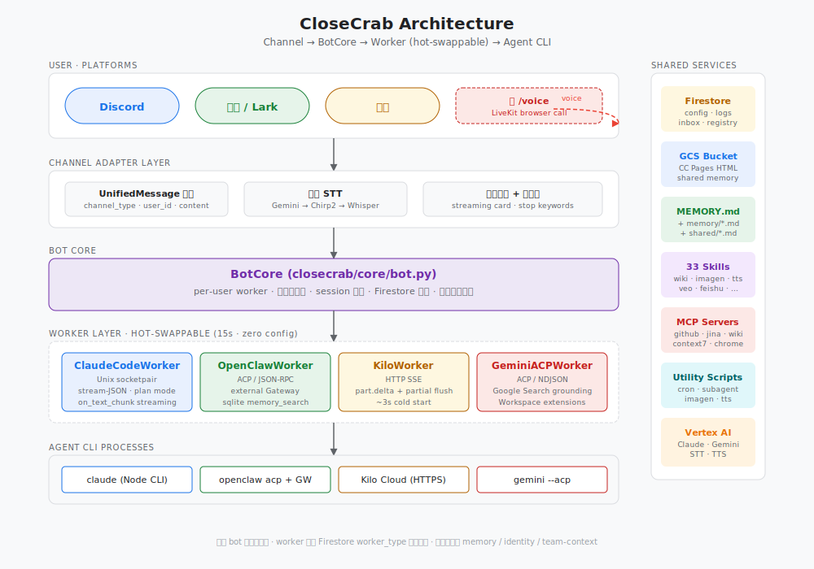
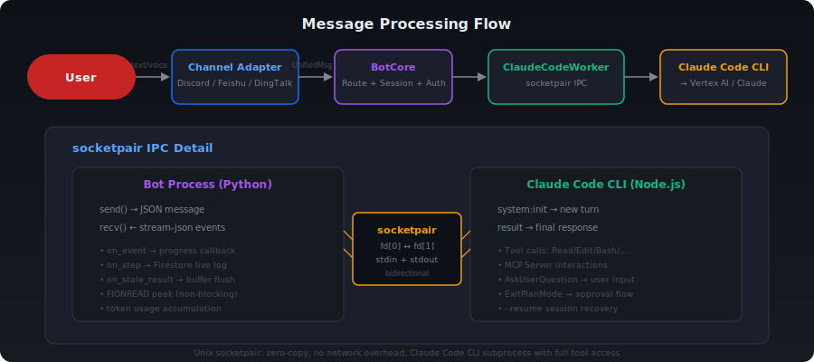
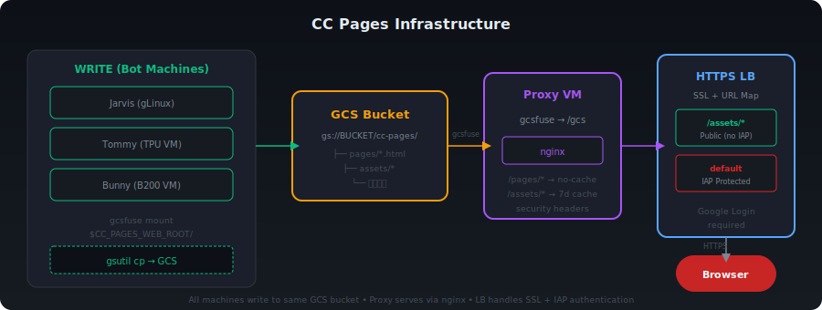

# CloseCrab 🦀

[](https://opensource.org/licenses/Apache-2.0)

<p align="center">
  
</p>

> 把 Claude Code 的全部能力接入 Discord / 飞书 / Lark / 钉钉，打造你的 24/7 AI 助手团队。

CloseCrab 通过 Unix socketpair 与 Claude Code CLI 进程通信，在聊天平台里提供完整的 Claude Code 体验——工具调用、MCP Server、Skills、Auto Memory、Agent Teams，一个不少。

## 架构

<p align="center">
  
</p>

消息从用户到 Claude，经过四层处理：

```
User → Channel Adapter → BotCore → ClaudeCodeWorker → Claude Code CLI (Vertex AI)
```

<p align="center">
  
</p>

- **Channel Adapter** — 将各平台消息统一为 `UnifiedMessage`，处理语音转文字、进度反馈、消息分片
- **BotCore** — 消息路由、会话管理、白名单鉴权、实时 Firestore 日志、急刹车中断
- **ClaudeCodeWorker** — 通过 `socketpair` 双向 IPC 与 Claude Code CLI 子进程通信，流式解析 JSON 事件，追踪 token 用量
- **Claude Code CLI** — 真正执行任务的引擎，拥有 Read/Edit/Bash/Grep 等工具和所有 MCP Server

### socketpair IPC

Bot 进程和 Claude Code CLI 之间用 Unix socketpair 通信，零网络开销：

- Bot 端通过 `fd[0]` 发送 JSON 消息，接收 stream-json 事件流
- CLI 端将 `fd[1]` 映射为 stdin/stdout，像正常终端一样工作
- 1 秒间隔的 Buffer Poller 通过 `FIONREAD` ioctl + `MSG_PEEK` 非阻塞监测数据
- 支持交互式流程：`ExitPlanMode`（Plan 审批）、`AskUserQuestion`（多选项回复）

## 前提条件

### 1. GCP 项目

```bash
# 安装 gcloud CLI（如未安装）
curl https://sdk.cloud.google.com | bash

# 登录 + 设置项目
gcloud auth login
gcloud config set project YOUR_PROJECT_ID

# 创建 ADC（Claude Code CLI 需要）
gcloud auth application-default login
```

需要的 GCP 服务：**Vertex AI**（Claude 模型调用）、**Firestore**（配置 + 状态存储）、**GCS**（可选，共享 memory 和 CC Pages）。

### 2. Firestore 数据库

```bash
gcloud firestore databases create \
  --database=closecrab \
  --location=asia-east1 \
  --type=firestore-native \
  --project=YOUR_PROJECT_ID

gcloud projects add-iam-policy-binding YOUR_PROJECT_ID \
  --member="user:YOUR_EMAIL" \
  --role="roles/datastore.user"
```

> `--location` 建议选靠近你的区域。完整列表见 [Firestore locations](https://cloud.google.com/firestore/docs/locations)。

### 3. 平台 Bot Token

<details>
<summary><b>Discord</b></summary>

1. [Discord Developer Portal](https://discord.com/developers/applications) → **New Application**
2. **Bot** → **Reset Token** → 复制 Token
3. 开启 **Message Content Intent** 和 **Server Members Intent**
4. **OAuth2** → Scopes: `bot`, `applications.commands`；Permissions: `Send Messages`, `Read Message History`, `Connect`, `Speak`
5. 用生成的 URL 邀请 bot 到 server

记下 `DISCORD_BOT_TOKEN` 和你的 Discord User ID（开发者模式 → 右键头像 → Copy ID）。
</details>

<details>
<summary><b>飞书 (Feishu)</b></summary>

1. [飞书开放平台](https://open.feishu.cn/app) → **创建企业自建应用**
2. 复制 `App ID` 和 `App Secret`
3. **事件与回调** → 订阅方式选 **长连接**，添加 `im.message.receive_v1`
4. **权限管理** → 申请 `im:message`、`im:chat`、`im:resource`
5. 创建版本 → 申请发布 → 管理员审批
</details>

<details>
<summary><b>Lark</b></summary>

流程同飞书，在 [Lark Developer](https://open.larksuite.com/app) 操作，API 域名为 `open.larksuite.com`。
</details>

<details>
<summary><b>钉钉 (DingTalk)</b></summary>

1. [钉钉开放平台](https://open-dev.dingtalk.com/) → **企业内部开发** → **创建应用**
2. 复制 `Client ID` 和 `Client Secret`
3. 开启 **Stream 模式**，申请 **企业内机器人** 权限
</details>

### 4. 系统依赖

| 依赖 | 版本 | 用途 |
|------|------|------|
| Python | 3.10+ | Bot 运行时 |
| Node.js | 18+ | Claude Code CLI、MCP Server |
| gcloud | - | GCP 认证 |

> `deploy.sh` 会自动检测并安装缺失的 `git`、`nodejs`、`npm`。

## 快速开始

```bash
# 1. 克隆
git clone https://github.com/yangwhale/CloseCrab.git
cd CloseCrab

# 2. 配置 Firestore 连接
cp .env.example .env
vim .env   # 填写 FIRESTORE_PROJECT 和 FIRESTORE_DATABASE

# 3. 一键部署（安装 Claude Code + Skills + Bot 依赖）
./deploy.sh

# 4. 添加 bot 配置
python3 scripts/config-manage.py add mybot

# 5. 启动
python3 -m closecrab --bot mybot           # 前台（调试）
python3 -m closecrab --bot mybot --daemon  # 后台
bash scripts/launcher.sh start mybot       # 带自动重启
```

`deploy.sh` 自动完成：安装 Claude Code CLI → GCP 认证 → 从 Firestore 拉取 API keys → 生成 `~/.claude/settings.json` → 部署 Skills → 同步 Memory → 安装 MCP Server 和 Python 依赖。

## 命令参考

### Slash 命令 (Discord)

| 命令 | 说明 |
|------|------|
| `/status` | 查看 bot 运行状态（机器、模型、会话数） |
| `/context` | 显示 context window 用量（token/轮次/时长/费用） |
| `/sessions` | 浏览和切换历史会话 |
| `/end` | 结束当前会话 |
| `/stop` | 中断正在执行的任务 |
| `/restart` | 重启 bot（exit code 42 触发自动重启） |
| `/docs` | 打开 CC Pages 知识库 |

### 急刹车

在任何平台发送以下关键词立即中断执行：

`停` `stop` `取消` `算了` `打住` `急刹车` `停下` `别做了` `不要了`

### 交互式审批

Claude Code 的 Plan Mode 和 AskUserQuestion 工具会映射到聊天界面：

- **Plan 审批** — Claude 进入 Plan Mode 后，用户在聊天中回复即可审批（支持 "开干"、"可以了" 等关键词）
- **用户提问** — AskUserQuestion 工具生成的选项显示在聊天中，用户直接回复选择

## 平台特性

| 特性 | Discord | 飞书 | 钉钉 |
|------|---------|------|------|
| 文字消息 | ✅ | ✅ | ✅ |
| 语音输入 | ✅ Voice Channel | ✅ 音频消息 | — |
| 进度反馈 | 编辑消息 + emoji | 动画螃蟹卡片 🦀 | 文字更新 |
| 消息引用 | ✅ Reply 上下文 | ✅ | — |
| 连接方式 | Gateway | WebSocket 长连接 | Stream 模式 |
| Slash 命令 | ✅ 7 个 | — | — |

### 语音输入 (STT)

支持三种引擎，可在 bot 配置中切换：

| 引擎 | 配置值 | 说明 |
|------|--------|------|
| Gemini Flash | `gemini` | 默认，速度最快 |
| Chirp2 | `chirp2` | Google Cloud STT v2 |
| Whisper | `whisper:medium` | OpenAI Whisper 本地推理 |

### 语音总结

飞书和 Discord 支持语音总结：Claude 在回复末尾添加 `<voice-summary>` 标签，bot 自动提取文本并通过 TTS 生成语音消息发送。适合复杂技术内容的口语化摘要。

## 配置

### .env（Firestore 引导）

```ini
FIRESTORE_PROJECT=your-gcp-project-id
FIRESTORE_DATABASE=closecrab
```

### Firestore Bot 配置

每个 bot 对应 `bots/{name}` 文档：

```json
{
  "active_channel": "discord",
  "model": "claude-opus-4-6@default",
  "claude_bin": "~/.local/bin/claude",
  "work_dir": "~/",
  "timeout": 600,
  "stt_engine": "gemini",
  "allowed_user_ids": [YOUR_DISCORD_USER_ID],

  "channels": {
    "discord": {
      "token": "BOT_TOKEN",
      "auto_respond_channels": [111111],
      "log_channel_id": "333333"
    },
    "feishu": {
      "app_id": "cli_xxxxx",
      "app_secret": "SECRET",
      "allowed_open_ids": ["ou_xxxxx"],
      "auto_respond_chats": ["oc_xxxxx"]
    },
    "dingtalk": {
      "client_id": "CLIENT_ID",
      "client_secret": "CLIENT_SECRET"
    }
  },

  "email": {
    "smtp_host": "smtp.feishu.cn",
    "smtp_port": 465,
    "imap_host": "imap.feishu.cn",
    "imap_port": 993,
    "user": "bot@example.com",
    "pass": "PASSWORD"
  },

  "team": {
    "role": "leader",
    "team_channel_id": "444444",
    "teammates": { "helper1": "BOT_DISCORD_ID" }
  },

  "inbox": {
    "project": "your-gcp-project-id",
    "database": "closecrab"
  }
}
```

| 字段 | 必填 | 说明 |
|------|------|------|
| `active_channel` | ✅ | `discord` / `feishu` / `lark` / `dingtalk` |
| `model` | — | Claude 模型，默认 `claude-opus-4-6@default` |
| `claude_bin` | — | Claude CLI 路径，默认 `~/.local/bin/claude` |
| `work_dir` | — | 工作目录，默认 `~/` |
| `timeout` | — | 单次对话超时（秒），默认 600 |
| `stt_engine` | — | 语音引擎：`gemini` / `chirp2` / `whisper:medium` |
| `allowed_user_ids` | — | 白名单用户 ID（空 = 允许所有） |
| `channels` | ✅ | 至少配置一个平台 |
| `email` | — | 飞书企业邮件 |
| `team` | — | 团队配置 |
| `inbox` | — | Inbox 通信 |

### settings.json（Claude Code 配置）

`config/settings.json` 是模板，`deploy.sh` 用 `envsubst` 替换占位符后写入 `~/.claude/settings.json`。

需要的环境变量（首次部署时交互输入，自动保存到 Firestore）：

| 变量 | 用途 |
|------|------|
| `ANTHROPIC_VERTEX_PROJECT_ID` | Vertex AI 项目 ID |
| `GITHUB_PERSONAL_ACCESS_TOKEN` | GitHub MCP Server |
| `CONTEXT7_API_KEY` | Context7 MCP Server |
| `JINA_API_KEY` | Jina AI MCP Server |
| `TAVILY_API_KEY` | Tavily MCP Server |
| `GEMINI_API_KEY` | Gemini CLI |
| `GCS_BUCKET` | GCS 存储桶 |
| `CC_PAGES_URL_PREFIX` | CC Pages 公网 URL |
| `CC_PAGES_WEB_ROOT` | CC Pages 本地写入路径（动态） |

## 会话管理

每个用户独立会话，支持持久化和恢复：

- **自动恢复** — Bot 重启后通过 `--resume` 恢复上次会话，用户无感
- **脏重启检测** — 检测到未正常关闭的会话时自动恢复
- **会话归档** — `/end` 结束当前会话，自动归档到历史
- **历史浏览** — `/sessions` 列出历史会话，点击切换
- **Context 监控** — 实时追踪 token 用量、轮次、时长、费用，进度条颜色告警（绿 <50% / 黄 50-80% / 红 >80%）

## Bot Team 协调

多个 bot 分布在不同机器上协同工作。

### 角色

| 角色 | 说明 |
|------|------|
| **Leader** | 接收用户任务，分解后 @mention 派活 |
| **Teammate** | 在自己的机器上执行，完成后回复 Leader |
| **Standalone** | 独立运行，不参与团队 |

### 通信通道

```
用户                    Leader Bot              Teammate Bot
  │                        │                        │
  │  "帮我做 X 和 Y"      │                        │
  ├───────────────────────>│                        │
  │                        │   @teammate 做 Y       │
  │                        ├───────────────────────>│
  │                        │                        │ (在远程机器执行)
  │                        │   [回复] Y 完成        │
  │                        │<───────────────────────┤
  │  "X 和 Y 都搞定了"    │                        │
  │<───────────────────────┤                        │
```

1. **@mention** — Leader 在团队频道 @mention teammate 派活，完成后回复
2. **Firestore Inbox** — bot 间直接消息，`on_snapshot` 实时推送，零延迟
3. **企业邮件** — 飞书 SMTP/IMAP 邮件通知

```bash
# 从脚本发消息给 bot
python3 scripts/inbox-send.py target_bot "请帮我检查服务器状态"
```

## 实时日志

对话开始即创建 Firestore log doc，每个 step 实时推送到 Control Board：

- 🟢 绿色脉冲指示 "running"，steps 自动展开并标注 "(live)"
- 暗色终端风格 Steps 面板（Catppuccin Mocha 配色）
- Tool 调用黄色、结果灰色、文本绿色
- 对话结束或异常退出自动 finalize（`try/finally`，status → done/error）

## Skills

19 个 Skill 通过拷贝部署到 `~/.claude/skills/`：

### 通用

| Skill | 用途 |
|-------|------|
| chat-style | 聊天平台消息格式适配 |
| page-style | HTML 页面风格规范 |
| notify | 多平台通知（Discord/飞书/微信） |
| bot-config | Firestore bot 配置管理 |
| skill-creator | Skill 开发指南 |
| issue-handler | GitHub Issue 处理 |
| agent-teams | Agent Teams 管理 |

### 媒体生成

| Skill | 用途 |
|-------|------|
| imagen-generator | Google Imagen 4 图片生成 |
| veo-generator | Google Veo 3.1 视频生成 |
| tts-generator | Edge TTS 语音合成 |
| frontend-slides | HTML 演示文稿生成 |
| paper-explainer | 论文大白话解读 |

### 飞书套件

| Skill | 用途 |
|-------|------|
| feishu-mail | 企业邮件收发回复 |
| feishu-doc | 飞书文档创建 |
| feishu-sheet | 飞书电子表格 |
| feishu-bitable | 飞书多维表格 |

### 基础设施

| Skill | 用途 |
|-------|------|
| tmux-installer | tmux + Oh My Tmux 配置 |
| tmux-orchestrator | tmux 多进程编排 |
| zsh-installer | Zsh + Oh My Zsh 配置 |

## Auto Memory

每个 bot 既有独立身份记忆，又共享团队公共知识。

### 两层架构

```
Bot A (gLinux)                    Bot B (TPU VM)                   Bot C (B200 VM)
     │                                 │                                │
     ▼                                 ▼                                ▼
~/.claude/projects/<proj>/memory/  ~/.claude/projects/<proj>/memory/  ~/.claude/projects/<proj>/memory/
├── MEMORY.md    ← 本机身份         ├── MEMORY.md    ← 本机身份         ├── MEMORY.md    ← 本机身份
├── feedback_*.md                   ├── feedback_*.md                   ├── feedback_*.md
└── shared/      ← gcsfuse ──────► └── shared/      ← gcsfuse ──────► └── shared/      ← gcsfuse
         │                                  │                                  │
         └──────────── 同一个 GCS 桶 ───────────────────────────────────────────┘
                    gs://BUCKET/memory/shared/
```

| 层 | 文件 | 范围 | 注入方式 |
|---|------|------|---------|
| **本机身份** | `MEMORY.md` | 每个 bot 独立 | Claude Code 自动注入（前 200 行） |
| **共享知识** | `shared/*.md` | 所有 bot 共享 | 按需读取（MEMORY.md 里放索引） |

### 零代码同步

用 GCS gcsfuse 把同一桶挂载到所有机器的 `shared/` 目录：

```bash
gcsfuse --implicit-dirs BUCKET/memory/shared ~/.claude/projects/<proj>/memory/shared
```

任何 bot 写入 `shared/` 的文件，其他 bot 下次对话自动可见，不需要同步代码。

> 早期用 Firestore 轮询同步（246 行代码），后来发现 gcsfuse 直接挂载就够了——零行代码替代。

### 备份

```bash
bash scripts/sync-memory.sh          # 同步到 private repo
bash scripts/sync-memory.sh --push   # 同步 + 提交 + push
```

## Control Board

<p>基于 Firebase Auth + Firestore 的单页管理面板，实时监控所有 bot。</p>

### 功能一览

- **Fleet Overview** — 所有 bot 一览，副标题实时显示 context 用量 + 颜色告警
- **Bot Detail** — Status / Config / Logs / Inbox / Chat 五个 tab
- **Context 监控** — 进度条 + token/轮次/时长/费用详情，10 秒刷新
- **Config 编辑** — General / Channel / Team / Email & Inbox 分组编辑
- **Global Config** — 系统配置 + Secrets（API keys 遮罩显示）
- **Chat 面板** — ChatGPT/Claude 风格 UI，通过 Inbox 与 bot 实时对话
- **Inbox 查看** — 收件/发件/全部视图，bot 间通信记录
- **实时日志** — Firestore onSnapshot 推送，暗色终端风格
- **拖拽排序** — sidebar bot 列表拖拽重排，顺序持久化
- **URL 路由** — hash 路由，刷新不丢状态
- **移动适配** — 响应式布局，手机端 sidebar 浮层
- **分页** — Logs/Inbox 支持 10/20/50/100/200 条/页

### 部署

单文件 SPA（`controlboard/index.html`），无需构建：

```bash
gsutil -h "Content-Type:text/html" cp controlboard/index.html \
  gs://YOUR_BUCKET/cc-pages/pages/control-board.html
```

前置配置：

1. **Firebase Auth** — 启用 Google 登录，将部署域名加入 Authorized domains
2. **Firestore Rules** — 限制白名单访问：
   ```
   rules_version = '2';
   service cloud.firestore {
     match /databases/{database}/documents {
       match /{document=**} {
         allow read, write: if request.auth != null
           && request.auth.token.email in ['your@email.com'];
       }
     }
   }
   ```
3. **Firebase Config** — 修改 `controlboard/index.html` 中的 `firebaseConfig`

技术栈：Firebase SDK v11 (ES module CDN) · Google Sans + Material Icons · Firestore onSnapshot 实时监听 · 零依赖零构建，单文件 ~97KB。

## CC Pages

Bot 生成的 HTML 报告、数据分析、Benchmark 结果通过域名发布。聊天消息有长度限制，CC Pages 是复杂输出的核心通道。

### 架构

<p align="center">
  
</p>

```
所有机器 (gcsfuse)        反代服务器 (nginx)          GCP HTTPS LB + IAP
     │                        │                          │
     ▼                        ▼                          ▼
  写入 GCS ──────────► nginx + gcsfuse ◄──────── HTTPS Load Balancer
  gs://BUCKET/cc-pages/                          ├── /assets/* → 公开
                                                 └── 其他路径  → IAP 登录
```

### 部署步骤

#### 1. 创建 GCS 桶

```bash
gsutil mb -l asia-east1 gs://YOUR_BUCKET/
```

#### 2. 配置反代服务器

在 GCE VM 上安装 gcsfuse + nginx：

```bash
cd infra/cc-pages
GCS_BUCKET=YOUR_BUCKET bash setup-proxy.sh   # 安装 gcsfuse → 挂载 GCS → 部署 nginx
```

#### 3. 创建 HTTPS Load Balancer + IAP

```bash
# 创建实例组
gcloud compute instance-groups unmanaged create cc-ig \
  --zone=YOUR_ZONE --project=YOUR_PROJECT
gcloud compute instance-groups unmanaged add-instances cc-ig \
  --zone=YOUR_ZONE --instances=YOUR_PROXY_VM --project=YOUR_PROJECT

# Health check
gcloud compute health-checks create http cc-hc \
  --port=80 --request-path=/ --project=YOUR_PROJECT

# 两个 backend service（IAP + 公开）
gcloud compute backend-services create cc-bs-iap \
  --protocol=HTTP --port-name=http --health-checks=cc-hc --global --project=YOUR_PROJECT
gcloud compute backend-services create cc-bs \
  --protocol=HTTP --port-name=http --health-checks=cc-hc --global --project=YOUR_PROJECT

# 挂载实例组
for bs in cc-bs-iap cc-bs; do
  gcloud compute backend-services add-backend $bs \
    --instance-group=cc-ig --instance-group-zone=YOUR_ZONE \
    --global --project=YOUR_PROJECT
done

# URL map（/assets/* 公开，其他走 IAP）
gcloud compute url-maps create cc-alb \
  --default-service=cc-bs-iap --project=YOUR_PROJECT
gcloud compute url-maps add-path-matcher cc-alb \
  --path-matcher-name=cc-paths \
  --default-service=cc-bs-iap \
  --path-rules="/assets/*=cc-bs" \
  --project=YOUR_PROJECT

# SSL + HTTPS 代理 + 转发规则
gcloud compute ssl-certificates create cc-ssl-cert \
  --domains=YOUR_DOMAIN --global --project=YOUR_PROJECT
gcloud compute target-https-proxies create cc-https-proxy \
  --url-map=cc-alb --ssl-certificates=cc-ssl-cert --global --project=YOUR_PROJECT
gcloud compute forwarding-rules create cc-https-rule \
  --target-https-proxy=cc-https-proxy --ports=443 --global --project=YOUR_PROJECT

# 启用 IAP + 授权
gcloud iap web enable --resource-type=backend-services \
  --service=cc-bs-iap --project=YOUR_PROJECT
gcloud iap web add-iam-policy-binding \
  --resource-type=backend-services --service=cc-bs-iap \
  --member="user:YOUR_EMAIL" --role="roles/iap.httpsResourceAccessor" \
  --project=YOUR_PROJECT
```

#### 4. DNS 解析

```bash
# 获取 LB 外部 IP，配置 CNAME 或 A 记录
gcloud compute forwarding-rules describe cc-https-rule \
  --global --project=YOUR_PROJECT --format='get(IPAddress)'
```

#### 5. 客户端配置

```bash
cd infra/cc-pages
GCS_BUCKET=YOUR_BUCKET bash setup-client.sh

export CC_PAGES_WEB_ROOT=~/gcs-mount/cc-pages
export CC_PAGES_URL_PREFIX=https://YOUR_DOMAIN
```

### 目录约定

| 路径 | 用途 | 访问控制 |
|------|------|----------|
| `/pages/*.html` | 报告、文档、Dashboard | IAP 保护 |
| `/assets/*` | 图片、OG 预览、公共资源 | 公开访问 |

## 部署运维

### 本地管理

```bash
bash scripts/launcher.sh start mybot     # 启动（带自动重启）
bash scripts/launcher.sh stop mybot      # 停止
bash scripts/launcher.sh restart mybot   # 重启
bash scripts/launcher.sh status          # 查看所有 bot 状态
bash scripts/launcher.sh logs mybot      # 查看日志
```

### 远程部署

```bash
bash scripts/dispatch-bot.sh deploy mybot remote-host  # 部署到远程机器
bash scripts/dispatch-bot.sh recall mybot              # 召回
bash scripts/dispatch-bot.sh move mybot new-host       # 迁移
bash scripts/dispatch-bot.sh check remote-host         # 检查环境
```

### 自动重启

Bot 收到 `/restart` 时以 exit code 42 退出，`run.sh` / `launcher.sh` 检测到 42 自动重启。

### 自注册

启动时自动上报到 Firestore registry：机器名、硬件信息、Claude Code 版本、context 使用情况。Control Board 的 Fleet Overview 据此展示所有 bot 状态。

## 项目结构

```
CloseCrab/
├── closecrab/                  # Bot 主包
│   ├── main.py                 # 入口：配置加载 → 组件组装 → 启动（支持 --daemon）
│   ├── constants.py            # 全局常量 + bootstrap
│   ├── core/
│   │   ├── bot.py              # BotCore：消息路由 + session 管理 + 日志 + 急刹车
│   │   ├── auth.py             # 白名单鉴权
│   │   ├── session.py          # 会话持久化 + 归档 + --resume 恢复
│   │   └── types.py            # UnifiedMessage 定义
│   ├── channels/
│   │   ├── base.py             # Channel 抽象基类
│   │   ├── discord.py          # Discord（slash 命令 / 语音 / 进度 / reply 引用 / 语音总结）
│   │   ├── feishu.py           # 飞书（卡片消息 / 长连接 / 螃蟹动画 / 语音总结 / TTS）
│   │   └── dingtalk.py         # 钉钉（Stream 模式）
│   ├── workers/
│   │   ├── base.py             # Worker 抽象基类
│   │   └── claude_code.py      # socketpair IPC + stream-json + Buffer Poller + context 追踪
│   └── utils/
│       ├── config_store.py     # Firestore 配置加载
│       ├── firestore_inbox.py  # Bot 间实时通信（on_snapshot）
│       ├── registry.py         # 自注册（硬件 + context 上报）
│       └── stt.py              # 语音转文字（Gemini / Chirp2 / Whisper）
├── skills/                     # 19 个 Skills（deploy.sh 拷贝到 ~/.claude/skills/）
├── scripts/
│   ├── launcher.sh             # 本地 bot 管理（start/stop/restart/status/logs）
│   ├── dispatch-bot.sh         # 远程 bot 部署 / 召回 / 迁移
│   ├── config-manage.py        # Firestore bot 配置 CRUD
│   ├── firestore-query.py      # Firestore 查询工具
│   ├── inbox-send.py           # Bot Inbox 发消息
│   ├── send-to-discord.sh      # 外部脚本发 Discord 消息
│   ├── sync-memory.sh          # Auto Memory 同步 + 备份
│   └── notify-on-complete.sh   # 后台任务完成通知
├── config/
│   ├── settings.json           # Claude Code settings 模板
│   └── env.sh                  # 环境变量声明
├── infra/
│   └── cc-pages/               # CC Pages 基础设施（setup + nginx 配置）
├── controlboard/
│   └── index.html              # Control Board 单页管理面板（~97KB）
├── deploy.sh                   # 一键部署脚本
├── run.sh                      # Bot 自动重启 wrapper
├── uninstall.sh                # 卸载脚本
├── .env.example                # .env 模板
└── .env                        # Firestore bootstrap（git-ignored）
```

## Contributing

See [CONTRIBUTING.md](CONTRIBUTING.md) for guidelines. By contributing, you agree that your contributions will be licensed under the Apache License 2.0.

## License

Copyright 2025-2026 Chris Yang (yangwhale)

Licensed under the Apache License, Version 2.0. See [LICENSE](LICENSE) for the full text.
