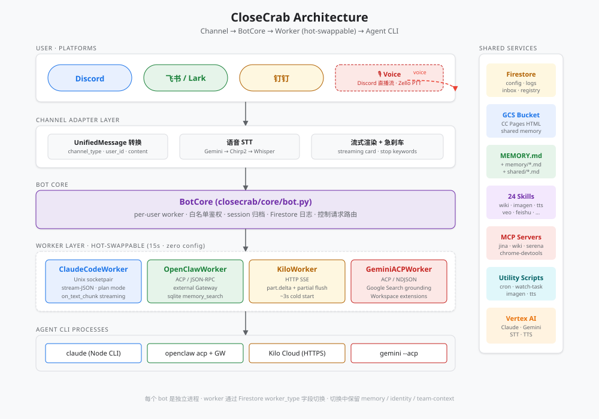
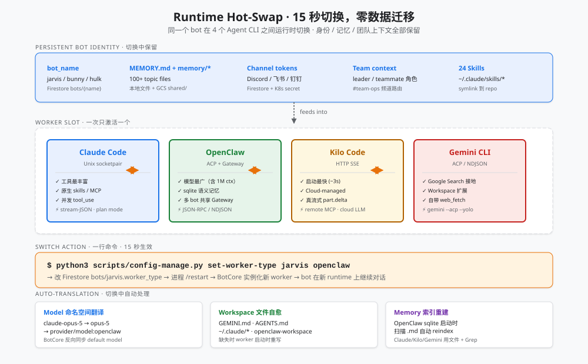
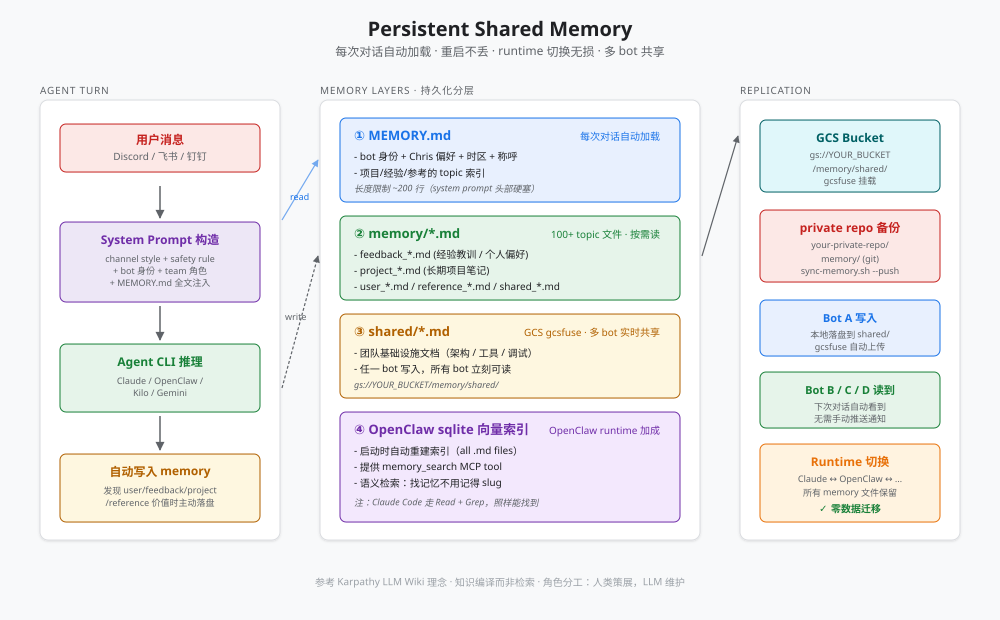
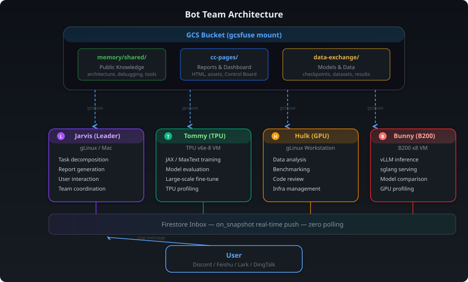

# CloseCrab 🦀

<p align="right">
  <a href="README.md"></a>
  <a href="README.en.md"></a>
  <a href="https://opensource.org/licenses/Apache-2.0"></a>
</p>

<p align="center">
  
</p>

> **把 Claude Code、OpenClaw、Kilo Code、Gemini CLI 变成 24/7 在线的聊天 Bot——跑在飞书、Discord、钉钉上，支持共享记忆、bot 间协作、运行时热切换、实时语音。**

CloseCrab 把全球顶尖的 AI Agent CLI 工具包装成多平台聊天 Bot。它不重新实现 agent 能力——直接驱动 CLI 进程，所以**上游生态里的每一个 Skill、Plugin、MCP Server 都能即装即用，零适配成本**。

> 🌍 **English readers**: see [README.en.md](README.en.md) for the full English documentation.

---

## 能力矩阵一览

**4 个 Agent Runtime · 3 个聊天平台 · 默认部署 24 个 Skill（仓库共 48 个，按 allowlist 放行）· 3 条语音通道 · 1 套统一身份和记忆。**

| 维度 | 能力 |
|---|---|
| 💬 **平台（3 个，飞书为主）** | 飞书 / Lark（一等公民）· Discord · 钉钉 |
| 🔄 **Runtime（4 个，热切换）** | Claude Code · OpenClaw · Kilo Code · Gemini CLI——任意 bot 15 秒切换 |
| 🎙️ **语音（3 条通道）** | 语音消息 STT+TTS · Discord 常驻语音频道**实时直播流** · Zello PTT 对讲 |
| 🧠 **共享记忆** | MEMORY.md + 100+ topic 文件 + GCS 同步 + OpenClaw sqlite 向量索引 |
| ⏰ **Timeline（定时 + 盯梢）** | `cron-tool` 到点叫醒 · `watch-task` 起小 agent 自己判断进度，SKIP/REPORT/DONE 三态 |
| 🤝 **Bot 团队** | 多 bot 跨机器协作 · `#team-ops` 频道派活 · Firestore inbox 实时推送 |
| 🔧 **Skill（默认 24 个）** | Wiki · Imagen/TTS/音乐生成 · 飞书邮件 · 浏览器自动化 · GPU 集群验收 · skill-creator 自举 |
| 📄 **CC Pages** | bot 生成 HTML 报告，一条命令发布到 GCS + 自定义域名 |
| 🔌 **完整上游生态** | Claude Code skills · MCP servers · Gemini extensions · OpenClaw plugins |

---

## 架构

<p align="center">
  
</p>

### 模块清单

| 层 | 路径 | 实现 |
|---|---|---|
| **入口** | `closecrab/main.py` | CLI 解析、配置加载、system prompt 构造、TTS 音色加载、信号处理 |
| **核心** | `closecrab/core/bot.py` | BotCore：消息路由、per-user worker、Firestore 日志、急刹车 |
| **Channels (3+1)** | `closecrab/channels/` | `feishu.py` · `feishu_streaming_card.py` · `discord.py` · `dingtalk.py` |
| **Workers (4 active)** | `closecrab/workers/` | `claude_code.py` · `openclaw_acp.py` · `kilo.py` · `gemini_acp.py` |
| **Voice** | `closecrab/voice/` | `discord_voice_sidecar.py`（直播流 + DAVE E2EE）· `zello_voice_sidecar.py`（PTT）· `tts_config.py`（音色单一来源）· `gemini_tts.py` · `gemini_stt.py` / `chirp_stt.py` / `funasr_stt.py` · `livekit_io.py` |
| **STT** | `closecrab/utils/stt.py` | Gemini → Chirp2 → Whisper fallback 链 |
| **Inbox** | `closecrab/utils/firestore_inbox.py` | Bot 间实时消息（Firestore `on_snapshot`） |
| **Timeline** | `scripts/cron-daemon.py` · `cron-tool.py` · `watch-task.py` | 单例 daemon 30s tick，定时任务与长跑盯梢共用一条时间线 |

---

## 4 个 Runtime · 运行时热切换

每个 runtime 是一个不同的 AI Agent CLI。CloseCrab 让同一个 bot 在它们之间运行时切换——**身份 / 记忆 / 团队上下文在切换中全部保留**。

<p align="center">
  
</p>

| Runtime | 通信方式 | 强项 | 切换命令 |
|---|---|---|---|
| **Claude Code** | Unix socketpair · stream-JSON | 工具最丰富、原生 skills、并发 tool_use、plan mode | `set-worker-type bot claude` |
| **OpenClaw** | ACP / JSON-RPC + 外部 Gateway | 模型最广、1M-token 可用、sqlite 语义记忆、共享 Gateway 省资源 | `set-worker-type bot openclaw` |
| **Kilo Code** | HTTP SSE | 启动最快 (~3s)、真流式 part.delta、Cloud-managed | `set-worker-type bot kilo` |
| **Gemini CLI** | ACP / NDJSON | Google Search 接地、Workspace 扩展、自带 web_fetch | `set-worker-type bot gemini` |

**切换中自动处理**：model 命名空间翻译（`claude-opus-4-7` → `provider/model:openclaw`）· workspace 文件自愈（GEMINI.md / AGENTS.md 缺失自动重写）· memory 索引重建（OpenClaw sqlite 启动扫描）。

> 延伸阅读：[Hybrid Agent Runtimes——4 个 Agent CLI 如何互相吸收对方的能力](https://blog.higcp.com/2026/05/17/hybrid-agent-runtimes/)

---

## 持久化共享记忆

<p align="center">
  
</p>

每个 bot 都有四层持久化记忆，重启、runtime 切换、迁移机器后不丢：

| 层 | 内容 | 加载时机 |
|---|---|---|
| **① MEMORY.md** | bot 身份 + 用户偏好 + topic 索引（~200 行硬上限） | 每次对话自动注入 system prompt |
| **② memory/*.md** | 100+ topic 文件：`feedback_*` 经验 · `project_*` 项目 · `user_*` 偏好 · `reference_*` 参考 | 按需 Read |
| **③ shared/*.md** | 团队基础设施文档，gcsfuse 挂载 GCS 桶 | 多 bot 实时共享 |
| **④ OpenClaw sqlite 向量索引** | 启动时扫描所有 `.md`，提供 `memory_search` MCP tool | OpenClaw runtime 加成（其他 worker 用 Read+Grep） |

**自动写入**：agent 在对话中发现 user / feedback / project / reference 级别的信息时主动落盘——参考 [Karpathy LLM Wiki](https://gist.github.com/karpathy/442a6bf555914893e9891c11519de94f) 理念，**知识编译而非检索**。

---

## Bot 团队协作

多 bot 跨机器协作，分两层通道：

- **协调通道**：Leader 在 `#team-ops` 飞书/Discord 频道用 `@mention` 派活，Teammate 完成后 `@Leader` 汇报
- **异步通道**：`scripts/inbox-send.py` 写 Firestore `messages` 集合，对端 bot 通过 `on_snapshot` **实时推送**（不是轮询）

<p align="center">
  
</p>

```bash
# Leader 给 teammate 派任务（异步，非阻塞）
python3 scripts/inbox-send.py bunny "在 B200 上跑 Llama 4 benchmark，写到 CC Pages 给我链接"
```

**Team 角色配置**存 Firestore `bots/{name}.team`，`build_system_prompt()` 根据角色动态注入协调规则，所以 Leader 看到的 system prompt 跟 Teammate 不一样。

多阶段任务走 **Inbox 协议 V1**：`kickoff` / `progress` / `done` 三种 phase 用同一个 `task_id` 串起来。progress **不触发**对端 LLM turn（只给人看），只有 done 触发一次，把全部 progress 打包进 prompt。详见 [docs/inbox-task-protocol.md](docs/inbox-task-protocol.md)。

---

## 语音 I/O

三条独立的语音通道，可以同时开：

| 通道 | 触发 | 链路 |
|---|---|---|
| **语音消息** | 用户在飞书 / Discord 发语音 | Channel 层 STT（Gemini→Chirp2→Whisper）→ BotCore → 回复 + TTS ogg 语音摘要 |
| **Discord 常驻语音频道** | `/discordon` | bot 常驻语音频道，回复**边生成边推流**（首帧 ~0.9s），支持 DAVE E2EE、暂停/继续/重播 |
| **Zello PTT 对讲** | `/zelloon` | Zello Channel API：对讲机按住说话 → Opus 解码 → STT → 走飞书消息通道；回复反向推成 PTT 流 |

**音色是 bot 级配置**，存 Firestore `bots/{name}.channels.discord.tts_voice`（Gemini TTS 的 15 个 voice 任选）。流式直播和 ogg 语音消息**共用同一个来源**，没配就直接报错——不做静默兜底，避免"改了配置不生效"这类问题。

**开关都会落盘**：`/discordon` `/discordoff` `/zelloon` `/zellooff` 写回 Firestore，跨重启保持。Zello 全网只有一个账号，`/zelloon` 会先检查是否已被别的 bot 占用（同账号双登会互踢）。

> LiveKit（`/voice` 浏览器通话）的房间与网页前端已停用；`closecrab/voice/livekit_io.py` 仍然承重 —— Discord 语音**接收**方向依赖它的 agents SDK，别按文件名误删。

---

## Timeline —— 定时任务与长跑盯梢

一条时间线，一个 daemon，两种用法。**由第一个 bot 的 `run.sh` 以单例方式拉起**，所以 daemon 跟 bot 同环境；机器上没 bot 就不会有 daemon。

| 用法 | 工具 | daemon 行为 |
|---|---|---|
| **到点叫醒某个 bot** | `cron-tool.py` | 不推理，到点往目标 bot 的 inbox 写一句话 |
| **盯长跑任务** | `watch-task.py` | 每隔 N 秒起一个小 agent 自己判断，三态：**SKIP** 静默 / **REPORT** 贴飞书（零 turn）/ **DONE** 写 inbox 交接并自行终止 |

```bash
# 定时提醒（--cron 与 --at 按 HKT 解释）
python3 scripts/cron-tool.py add --target <bot> --in 10m --message "..."
python3 scripts/cron-tool.py add --target <bot> --cron "0 9 * * MON-FRI" --message "..."
python3 scripts/cron-tool.py list|remove <job_id>

# 盯一个训练/压测，有进展才出声
python3 scripts/watch-task.py create --name t80 --interval 120 --model sonnet \
    --notify-bot <bot> --max-age 7200 \
    --prompt "读 /tmp/t80.log 判断进度。出现 TRAINING COMPLETE 或 Error 时用 DONE。没变化就 SKIP。"
python3 scripts/watch-task.py list|stop <name>
```

**设计要点**：

- **通知与触发事件走不同通道**。REPORT 用 `feishu-notify.py` 直接贴消息，**零 turn 零 token**；DONE 写 inbox，触发主进程一次完整 turn 来接手。别让"看一眼就行"的播报去烧 turn。
- **探针档位自选**：`--model haiku`（看日志变没变，默认）/ `sonnet`（要读懂内容再判断）/ `opus`（要做真取舍）。
- **任务钉在创建它的机器上**。每条记录带 host 归属，多机共驱一条时间线靠 Firestore 事务抢占；没有 host 归属的记录会被直接删除。
- **有硬上限**：`--max-age` 默认 6 小时自动收，`--stall-after` 连续无进展算疑似卡住。**不要往系统 crontab 里塞会调 LLM 的东西**——那种条目没有 owner、`list` 看不见、不会自终止。

设计细节见 [docs/task-scheduler-design.md](docs/task-scheduler-design.md)。

---

## 默认部署的 Skill（24 个）

每个 skill 是 `skills/{name}/SKILL.md` 加可选的 `scripts/` 和 `references/`。**deploy.sh 只 link `config/skill-allowlist.txt` 里放行的**——仓库里还有 20 多个低频 skill，源码都在、默认不装，需要时在 allowlist 加一行再跑 deploy 就回来。新建 skill 用 `skill-creator` 自举。

| 分类 | Skills |
|---|---|
| **知识与记忆** | `wiki`（Quartz Wiki + 9 个 MCP tools）· `session-handoff`（会话崩了写交接） |
| **多媒体生成** | `imagen-generator` · `tts-generator`（15 voice + 情绪标签）· `music-generator`（Lyria）· `deck-builder`（PPT / Google Docs）· `live-canvas`（实时白板讲解） |
| **浏览器 / 阅读** | `browser-cli`（CDP 直连，比 MCP 省 40 倍 token）· `wechat-reader`（公众号文章，绕验证码） |
| **飞书** | `feishu-mail`（企业邮箱收发）· `feishu-user-msg` |
| **GPU 集群** | `nvl72-qa`（GB200/GB300 验收：DCGM 诊断 · NCCL 带宽 · 跨域多节点 · 故障节点处理） |
| **生活 / 本地** | `weather-forecast`（香港天文台 + Open-Meteo）· `hk-bus`（Maps + KMB/Citybus 实时到站）· `hk-share-award-tax-dipn38`（香港股票报税 DIPN 38） |
| **运维** | `smoke-test`（部署后健康检查）· `cc-pages-backup` · `bot-config` |
| **元能力** | `skill-creator`（自举）· `agent-teams`（团队协调）· `evolution`（三方互评优化 worker）· `notify`（多平台通知）· `chat-style` / `page-style`（输出风格，注入式） |

> 部分 skill 依赖内部环境（Google 内网 MCP、客户群追踪等），放在私有仓库，不在这份清单里。

## 跨 Worker 通用脚本

不依赖具体 worker 的运行时能力，所有 bot 都能调：

```bash
# 真并行多个 LLM sub-agent（每个独立推理 + bash + read）
python3 scripts/subagent-parallel.py --inline '{"tasks":[{"label":"A","prompt":"..."}]}'

# 定时 / 盯梢（见上面 Timeline 章节）
python3 scripts/cron-tool.py   add|list|remove ...
python3 scripts/watch-task.py  create|list|stop ...

# 只发通知，零 turn 零 token（跟"写 inbox 触发 turn"是两回事）
python3 scripts/feishu-notify.py "跑到第 2 步了"

# 自查 model / cost / token / 历史 turns
python3 scripts/session-status.py <bot> [--days N]

# 安全自重启（agent 不能 kill 自己的父进程，用这个写 marker 走 exit-42）
BOT_NAME=<bot> python3 scripts/self-restart.py --note "重启后要做的事"

# 图片 / 语音生成
skills/imagen-generator/scripts/imagen-generate.sh "prompt" --aspect 16:9
skills/tts-generator/scripts/tts-generate.py "[casually] hello"
```

---

## 快速开始

```bash
# 1. 克隆
git clone https://github.com/yangwhale/CloseCrab.git && cd CloseCrab

# 2. 配置 Firestore（只填 project + database，其它走 Firestore）
cp .env.example .env && vim .env

# 3. 一键部署（交互式引导 API keys，会装 Claude Code + Gemini CLI + Skills + Python 依赖）
./deploy.sh

# 4. 创建 bot（默认 channel 推荐飞书）
python3 scripts/config-manage.py create mybot --channel feishu \
    --app-id "cli_xxxxxxx" --app-secret "xxxxxxxxxxxx"

# 5. 启动（run.sh 是带自动重启的 wrapper，同时负责单例拉起 cron-daemon）
nohup ./run.sh mybot > /tmp/mybot.log 2>&1 &
```

> **Pro tip**：已经装了 Claude Code？在这个目录跑 `claude`，然后说"按照 README 帮我部署成飞书 bot"——它会读这份文档帮你搞定全程。

### 开机自启

```bash
# 三台机器的 @reboot 都调它；幂等，随时可手动跑验证
scripts/boot-autostart.sh [--check]
```

顺序：补 cron 最小环境 → 等 DNS → gcsfuse → OpenClaw Gateway → `launcher.sh start all`。**cron-daemon 不在这里起**，由第一个 bot 的 run.sh 拉起，这样它跟 bot 拿到同一份 PATH。

---

## ⚠️ Claude Code CLI 升级注意事项

> **别随便升级**。CC 没有 auto-upgrade，所有升级都是手动 `claude install <version>`。历史上 **2.1.144 / 2.1.145 出现过 900K 上下文 regression**，所以每次升级前**必须**先验证「上下文有没有被卡死在 200K」。

### 历史 regression（2026-05-21 二分法实测）

| 版本 | 状态 | 行为 |
|------|------|------|
| 2.1.143 | ✅ 当时的良品 | autoCompactWindow=900000 生效，peak cache_read 369K 无 compact |
| 2.1.144 | ❌ Compact thrashing | 5 分钟内 3 次 compact；post-compact 仅 20K 可用预算 |
| 2.1.145 | ❌ Cap 钳死 ~200K | 不 thrash 但完全锁死 900K 配置 |
| **2.1.226** | ✅ **当前主力** | 2026-08-09 实测：peak cache_read **805K**，新增 compact **0** |

根因（反编译验证）：`Math.min(jL() cap, autoCompactWindow) - min(CqH(H), 20000)`，144 改了 compact decision function 让 `autoCompactWindow` 失效。

### 升级前必检清单

```bash
# Step 1: 记下当前良品版本（旧版本留在 versions/ 目录里当回滚点）
readlink ~/.local/bin/claude

# Step 2: 装目标版本（原生 installer 只换 symlink）
~/.local/bin/claude install <target-version>

# Step 3: 拿一个非主力 bot 做压力测试，让它连读 5 个大文件
python3 scripts/inbox-send.py <test-bot> "请依次 Read 这 5 个大文件不要停 ..."

# Step 4: 验收标准（两项都要满足才算 PASS）
#   ✅ peak cache_read > 250K        （证明 cap 没被钳到 200K）
#   ✅ 本次新增 compact 事件 = 0      （证明没 thrash）

# Step 5: 失败 → 立即回滚
~/.local/bin/claude install <known-good-version>

# Step 6: PASS 才推全 fleet
```

> **两个测量陷阱**：
> 1. `claude --version` 查的是 **PATH 上**那个（可能是 npm 装的），**不是 bot 实际调用的**。要问就问代码：`_resolve_config(bot)["claude_bin"]` 再对它 `--version`。
> 2. 别把 `claude_bin` 写成 `versions/2.1.156` 这种**绝对版本路径**——那会让该 bot 永远停在那个版本，`claude install` 换的是 symlink，绕不过绝对路径。统一指向 `~/.local/bin/claude`。

---

## 平台配置详解

> 飞书是 CloseCrab 的 **一等公民**——下面的配置最完整。Discord 和钉钉是基础支持。

### 飞书 / Lark（推荐）

飞书是 CloseCrab 主力平台，配套 4 类事件订阅 + 4 类回调 + 完整命令体系。**只复制 App ID 和 Secret 是远远不够的**，需要额外配置以下内容：

#### Step 1 — 创建应用 & 拿凭据

1. 打开 [飞书开放平台](https://open.feishu.cn/app) → **创建企业自建应用**
2. 在 **凭证与基础信息** 复制 `App ID`（形如 `cli_xxxxxxx`）和 `App Secret`
3. Lark 海外版同样流程，在 [Lark Developer](https://open.larksuite.com/app) 操作

#### Step 2 — 事件与回调（4 类必备订阅）

进 **事件与回调 → 事件订阅**，订阅方式选 **长连接**（CloseCrab 不需要 webhook URL），添加以下 4 个事件：

| 事件名 | API 标识 | 作用 |
|---|---|---|
| **消息接收** | `im.message.receive_v1` | 基础：用户发文字 / 语音 / 卡片消息给 bot |
| **消息表情回应** | `im.message.reaction.created_v1` | **点赞功能**：用户给 bot 上一条消息加 emoji 当快捷指令 |
| **卡片回调** | `card.action.trigger`（自动绑定，无需单独订阅）| 卡片按钮 / 下拉菜单点击事件 |
| **机器人菜单** | `application.bot.menu_v6` | **斜杠命令的回调**：用户点击 bot 头像里的菜单项 |

> ⚠️ **常被遗漏的两项**：`reaction.created_v1` 和 `bot.menu_v6` 默认不订阅，导致用户给 bot 加 👍 没反应、点 bot 菜单没反应。

#### Step 3 — 权限管理

进 **权限管理**，申请以下 scope：

| 权限组 | 子权限 | 用途 |
|---|---|---|
| **`im:message`** | `im:message`（接收）· `im:message:send_as_bot`（发送）· `im:message.reaction:write`（加 emoji 反应）| 文字 + 语音 + 卡片 |
| **`im:chat`** | `im:chat:readonly` | 区分单聊/群聊（reaction 处理用到） |
| **`im:resource`** | `im:resource` | 下载语音 / 图片附件 |
| **`contact:user.base:readonly`**（可选）| | 拿到用户名做日志展示 |

#### Step 4 — 机器人菜单配置

进 **机器人能力 → 自定义菜单**，`event_key` 填命令名（带不带 `/` 都行，bot 会自动规范化）。推荐配这 8 个：

| 显示名 | event_key | 作用 |
|---|---|---|
| 📊 状态 | `status` | 显示当前 worker / model / cost / token 用量卡片 |
| 🔄 重启 | `restart` | 重启 bot 进程（用 run.sh 的 exit 42 触发） |
| 🛑 停止 | `stop` | 中断当前 turn（同 "停" "取消" 等关键词） |
| 🧹 结束 session | `end` | 清空当前 session 上下文 |
| 📋 Session 列表 | `sessions` | 用卡片+下拉切换历史 session |
| 📈 Context | `context` | 展示当前 context window 使用率 |
| 📚 文档 | `docs` | 飞书内显示 CloseCrab 文档链接 |
| 🎙️ Discord 语音 | `discordon` | 让 bot 连进 Discord 常驻语音频道 |

**完整命令集（23 个，直接发消息也能用）**：

| 分组 | 命令 |
|---|---|
| 会话 | `/status` `/end` `/restart` `/stop` `/context` `/sessions` `/docs` |
| 模型与推理档位 | `/model` `/low` `/medium` `/high` `/xhigh` `/think` `/mode` `/mcp` |
| 上下文压缩 | `/cmp`（透传 Claude Code 的 compact） |
| 语音 | `/voice` · `/discordon` `/discordoff` · `/zelloon` `/zellooff` · `/hlson` `/hlsoff`（HLS 直播） |

#### Step 5 — Reaction 快捷指令（点赞语义）

用户给 bot 上一条消息加 emoji，会被合成为一段"用户表态"消息发给 LLM。**约束**：只对 **bot 自己发出的消息** 上的 reaction 响应（避免群里别人互相 reaction 触发 bot）。

| Emoji | 飞书 type | 语义 |
|---|---|---|
| 👍 | `THUMBSUP` | 批准 / 满意 / 继续 |
| 👌 | `OK` | 确认收到 |
| ✅ | `AGREE` | 同意 |
| ❌ | `X` | 否决 / 取消刚才的提议 |
| 🙅 | `NO_GOOD` | 否决 / 不要这样做 |
| ❓ | `QUESTION` | 希望进一步解释 |
| 🤔 | `THINKING` | 希望深入分析 |

其他 emoji 默认不映射，由 LLM 自行判断是否响应。

#### Step 6 — 卡片按钮回调

bot 发的交互卡片（如 `ExitPlanMode` 审批卡、`/sessions` 切换卡）的按钮 / 下拉菜单点击，通过 `card.action.trigger` 事件回传。卡片用 `_decode_feishu_card_action()` 校验：
- 发起人必须是原 chat 的用户（防止群里别人点别人的卡片）
- 卡片必须未过期（默认 1 小时）
- 卡片必须在当前 session 上下文

无需额外订阅，绑定卡片即生效。

#### Step 7 — 发布

创建版本 → 申请发布 → 管理员审批通过后，bot 才能在企业内使用。

#### Step 8 — 把凭据填到 Firestore

```bash
python3 scripts/config-manage.py create mybot --channel feishu \
    --app-id "cli_xxxxxxx" --app-secret "xxxxxxxxxxxxx"

# 可选：单聊 + 群聊 + log_chat（专门转发日志的群）
python3 scripts/config-manage.py set-feishu mybot \
    --allowed-open-ids "ou_xxx,ou_yyy" \
    --log-chat-id "oc_zzzz"
```

#### Step 9 — 选填：飞书企业邮件

每个 bot 可独立配置企业邮件，详见 [docs/full-reference.md](docs/full-reference.md)。

---

### Discord

1. 打开 [Developer Portal](https://discord.com/developers/applications) → **New App** → 改名 → **Bot** 子页 → 复制 Token
2. 开启 **Message Content Intent**（必须，否则收不到消息内容）
3. **OAuth2 → URL Generator**：勾 `bot` + `applications.commands`，权限勾 `Send Messages` `Read Message History` `Connect`（语音）`Speak`（语音）
4. 拿生成的邀请 URL 邀请到 server
5. 配置到 Firestore：

```bash
python3 scripts/config-manage.py create mybot --channel discord --token "DISCORD_TOKEN"
python3 scripts/config-manage.py set-discord mybot --allowed-user-ids "123,456"
```

Discord 自带 7 个 slash command（`/status` `/end` `/restart` `/stop` `/docs` `/context` `/sessions`），bot 启动时自动注册到 Server。

**常驻语音频道**（可选）：active channel 是飞书时，也能让 bot 额外连一条只做语音输出的 Discord 连接。配 `channels.discord.voice_sidecar=true` + `voice_channel_id` + `tts_voice`，或运行时发 `/discordon`（会落盘，跨重启保持）。

---

### 钉钉（基础支持）

1. [钉钉开放平台](https://open-dev.dingtalk.com/) → **企业内部开发** → 创建应用
2. 复制 `Client ID` + `Client Secret`
3. 开启 **Stream 模式**（CloseCrab 长连接），勾 **企业内机器人** 权限
4. 配到 Firestore：

```bash
python3 scripts/config-manage.py create mybot --channel dingtalk \
    --client-id "dingxxxx" --client-secret "xxxxxxxxxxxx"
```

钉钉只支持文字消息，不支持语音 / 斜杠命令 / 卡片按钮回调。

---

## 你需要准备什么

| 必备 | 说明 |
|---|---|
| **GCP 项目** | Vertex AI（Claude / Gemini 模型）+ Firestore（配置 + inbox + logs） |
| **聊天平台 Bot** | 飞书 / Discord / 钉钉任选（推荐飞书） |
| **Linux 机器** | GCE VM、gLinux、WSL、Ubuntu/Debian 均可。Python 3.10+, Node.js 20+ |

| 可选 | 用处 |
|---|---|
| **GCS 桶** | CC Pages（Web 报告）+ 跨机器共享 memory（gcsfuse 挂载） |
| **MCP API keys** | GitHub · Context7 · Jina——各解锁一个 MCP server |
| **Zello 账号** | PTT 对讲通道（开发者 token 由本地私钥每次登录现签） |

> **Python 3.13+ 注意**：`audioop` 已被 PEP 594 移除，Discord 语音 sidecar 在新系统上需要先装 `audioop-lts`。音色配置模块 `voice/tts_config.py` 已刻意做成零重依赖，不受影响。

---

## 平台功能对比

| 功能 | 飞书 / Lark | Discord | 钉钉 |
|---|---|---|---|
| 文字消息 | ✅ | ✅ | ✅ |
| 语音输入 STT | ✅ 语音消息 | ✅ 语音频道 | — |
| 语音摘要 TTS（ogg） | ✅ | ✅ | — |
| 常驻语音频道实时推流 | — | ✅ `/discordon`（DAVE E2EE） | — |
| Zello PTT 对讲 | ✅ 消息回灌飞书 | — | — |
| 交互卡片 | ✅ animated card · streaming card · 卡片按钮回调 | edit + emoji | — |
| 点赞 → 快捷指令 | ✅ 7 种 emoji 语义 | — | — |
| 命令 | ✅ 23 个 | ✅ 7 个 slash command | — |
| 消息引用 | ✅ | ✅ | — |
| 连接方式 | WebSocket (lark_ws 长连接) | Discord Gateway | Stream |

---

## 急刹车

任何平台发以下关键词立即中断当前 turn：

`停` `stop` `取消` `算了` `打住` `急刹车` `停下` `别做了` `不要了`

中断不是 SIGINT，是通过 worker 自己的协议传过去（Claude socketpair / ACP `session/cancel` / SSE close），保证 agent 干净退出。

---

## 运维工具

```bash
# 本地 bot 管理（内部直接调 run.sh，不另抄重启循环）
scripts/launcher.sh start|stop|restart|status|logs <bot>

# 开机自启（幂等）
scripts/boot-autostart.sh [--check]

# 健康检查（进程 / Firestore / worker secrets / 日志活性 / 近期错误）
scripts/closecrab-smoke-test.sh <bot> [--json] [--actions]

# 远程部署（多 bot 调度）
scripts/dispatch-bot.sh deploy|recall|move|check <bot> <host>

# Runtime 切换
scripts/config-manage.py set-worker-type <bot> claude|openclaw|kilo|gemini

# Bot 间消息（Firestore inbox，on_snapshot 实时推送）
scripts/inbox-send.py <target> "<msg>"

# 记忆同步备份（GCS + private repo）
scripts/sync-memory.sh --push|--pull
```

### 退出码约定（run.sh 行为）

| 码 | 含义 | 重启 |
|----|------|------|
| `42` | `/restart` 或 `self-restart.py` | 立即重启 |
| `130` / `137` / `143` | SIGINT / SIGKILL / SIGTERM | 不重启 |
| `1` | 配置错误 | 不重启 |
| 其他非零 | 崩溃 | 重启（连续 >10 次停止） |

---

## 文档

| 文档 | 内容 |
|---|---|
| [完整参考](docs/full-reference.md) | 详细部署指南、配置参考、故障排查 |
| [Timeline 设计](docs/task-scheduler-design.md) | cron-daemon 单例、watch-task 三态协议、多机事务抢占 |
| [Inbox 任务协议 V1](docs/inbox-task-protocol.md) | kickoff / progress / done 三阶段，progress 旁路省 turn |
| [OpenClaw 部署指南](docs/openclaw-deploy-quickstart.md) | OpenClaw Gateway + agent.json 配置 |
| [OpenClaw Worker 设计](docs/openclaw-worker-design.md) | ACP 协议、per-bot session 路由、context 压缩 |
| [Kilo Worker 设计](docs/kilo-worker-design.md) | HTTP SSE、part.delta + emitted_len 不变量 |
| [GBrain 集成指南](docs/gbrain-integration.md) | PGLite memory bank + OAuth MCP + per-bot 独立部署（可选） |
| [博客: Hybrid Agent Runtimes](https://blog.higcp.com/2026/05/17/hybrid-agent-runtimes/) | 4 个 runtime 互相吸收能力的设计哲学 |

---

## Contributing

See [CONTRIBUTING.md](CONTRIBUTING.md) for guidelines.

## License

Copyright 2025-2026 Chris Yang (yangwhale). Apache License 2.0 — see [LICENSE](LICENSE).
